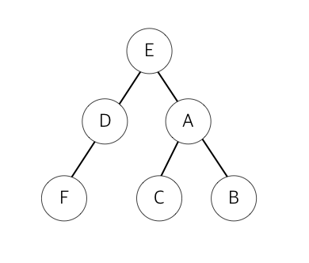
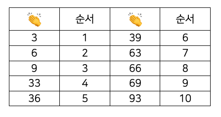
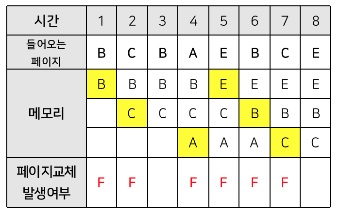
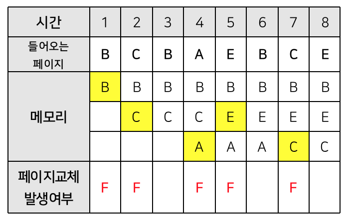
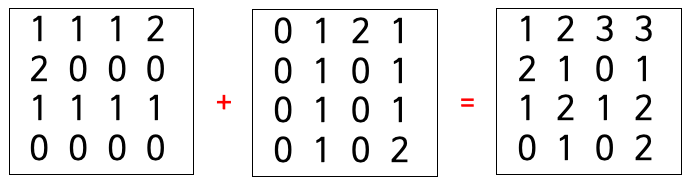
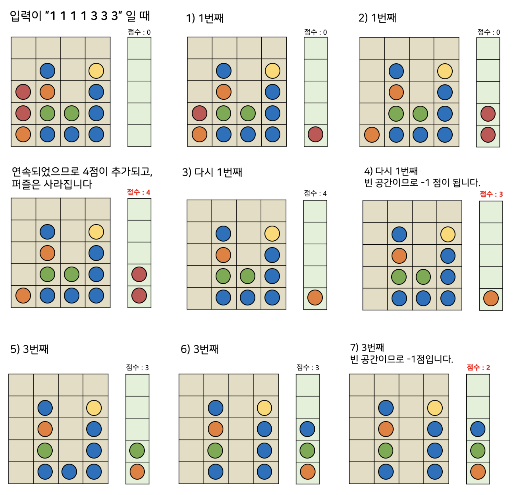

## Python 00

다음 리스트에서 400, 500를 삭제하는 code를 입력하세요.

    nums = [100, 200, 300, 400, 500]

## Python 01

`pass` 부분에 리스트 내장함수를 insert를 이용하여 코드를 입력하여 다음과 같이 `출력`되게 하세요.

    L = [200, 100, 300]
    pass
    print(L)

#### >> 출력
    [200, 100, 10000, 300]

## Python 02

다음 출력 값으로 올바른 것은?

    L = [100, 200, 300]
    print(type(L))

1. class 'str'
1. class 'int'
1. class 'list'
1. class 'tuple'

`정답.` 3번입니다.

## Python 03

다음 변수 `a`를 `print(type(a))`로 넣었을 때 출력될 값과의 연결이 알맞지 **않은** 것은?
1. `a = 1`         >>> `class 'int'`
1. `a = 2.22`      >>> `class 'float'`
1. `a = 'p'`       >>> `class 'char'`
1. `a = [1, 2, 3]` >>> `class 'list'`

`정답.` 3번입니다.

## Python 04

다음 코드의 출력 값을 예측하여라.

    a = 10
    b = 2
    for i in range(1, 5, 2):
        a += i
        print(a)
    print(a+b)

## Python 05

다음은 파이썬 문법 중에서 False로 취급하는 것들 입니다.

앗, False로 취급하지 않는 것이 하나 있네요! **True**를 찾아주세요.
1. None
1. 1
1. ""
1. 0
1. bool(0)

## Python 06

다음 중 변수명으로 사용할 수 없는 것 **2개**를 고르시오.
1. age
1. a
1. as
1. _age
1. 1age
1. 나이

`정답.` 3번과 5번입니다.

as, if, for 같은 예약어는 변수로 사용할 수 없습니다. 또한 변수는 숫자로 시작할 수 없습니다. 한글명은 변수로 사용할 수 있습니다. 

변수명은 알아보기 쉽게 적어야 하므로 적당히 underscore _ 를 사용하는 것을 선호합니다.

## Python 07

딕셔너리를 다음과 같이 만들었다. 출력 값을 예측하여라.

```python
d = {'height':180, 'weight':78, 'weight':84,
     'temparture':36, 'eyesight':1, }
print(d['weight'])
```

## Python 08

`sep`과 `end`를 활용하여 다음 소스 코드를 완성하여 날짜와 시간을 다음과 같이 `출력`되게 하시오.

    year = '2019'
    month = '04'
    day = '26'
    hour = '11'
    minute = '34'
    second = '27'

    print(year, month, day, )
    print(hour, minute, second, )

#### >> 출력
```
2019/04/26 11:34:27
```

## Python 09

크리스마스 날, 은비는 친구들과 함께 파티를 하기로 했습니다. 그런데, 크리스마스 트리를 사는 것을 깜빡하고 말았습니다. 온 가게를 돌아다녀 봤지만 크리스마스 트리는 모두 품절이었습니다. 

하는 수 없이 은비는 프로그래밍으로 트리를 만들기로 합니다. 

**은비를 위해 다음 예시와 같이 작동하는 프로그램을 작성해 주세요.**

#### >> 입력
    5

#### >> 출력

        *
       ***
      *****
     *******
    *********

## Python 10

$1$부터 $100$까지 모두 더한 결과를 얻기 위해 `pass` 부분을 수정하여 완성하세요. 이 때 for를 사용합니다.

    s = 0
    pass
    print(s)

## Python 11

다음 소스코드에서 `pass` 부분을 수정하여 클래스 작성을 완성하여, 게임 캐릭터의 능력치와 '파이어볼'이 출력되게 만드시오.

**주어진 소스 코드를 수정해선 안됩니다.**

    class Wizard:
        pass
    x = Wizard(health = 545, mana = 210, armor = 10)
    print(x.health, x.mana, x.armor)
    print(x.attack())
    print(x)

#### >> 출력
    545 210 10
    파이어볼
    Armor. 10 / Health. 545 / Mana. 210 / Attack. 파이어볼

## Python 12

우리 태양계를 이루고 있는 행성은 수성, 금성, 지구, 화성, 목성, 토성, 천왕성, 해왕성으로 총 8개 입니다. 저희는 우리 태양계의 n번째 행성이 무엇인지 알고 싶습니다.

입력으로 행성의 순서를 나타내는 숫자 n이 입력하면 출력으로 그 순서에 해당하는 행성의 이름을 출력해 주세요. 예를들어 두번째 행성은 금성입니다. 

#### >> 입력
    2

#### >> 출력
    금성

## Python 13

영희는 친구와 게임을 하고 있습니다. 서로 돌아가며 랜덤으로 숫자를 하나 말하고 그게 3의 배수이면 박수를 치고 아니면 그 숫자를 그대로 말하는 게임입니다.

입력으로 랜덤한 숫자 $n$이 주어집니다.

만약 그 수가 **3의 배수라면 '짝'이라는 글자를, 3의 배수가 아니라면 n을 그대로 출력**해 주세요.

#### >> 입력
    3

#### >> 출력

    짝

#### >> 입력
    2

#### >> 출력
    2

## Python 14

신학기가 시작되고, 아이들이 돌아가면서 자기소개를 하기로 했습니다.

    name = "김다정"
    age = 10

위와 같이 name과 age 두 변수가 주어지면 다음과 같이 출력하는 코드를 만들어 주세요.

> 안녕하세요. 저는 김다정이고 10세 입니다. <br>
> 안녕하세요. 저는 김다정이고 10세 입니다. <br>
> 안녕하세요. 저는 김다정이고 10세 입니다.

이 때 첫번째, 두번째, 세번째 출력은 각각 f-string, format method, formatting을 이용하세요.

## Python 15

문장이 입력되면 거꾸로 출력하는 프로그램을 만들어 봅시다.

#### >> 입력

    거꾸로

#### >> 출력

    로꾸거

## Python 16

유주는 놀이공원 아르바이트 중입니다. 그런데 놀이기구마다 키 제한이 있습니다.
유주가 담당하는 놀이기구는 키가 140 이상만 탈 수 있습니다.

입력으로 키가 주어지면
키가 140이 이상이면 **YES**를 틀리면 **NO**를 출력하는 프로그램을 작성하세요.

## Python 17

영하네 반은 국어, 수학, 영어 시험을 보았습니다. 영하는 친구들의 평균 점수를 구해주기로 했습니다.

공백으로 구분하여 세 과목의 점수가 주어지면
**전체 평균 점수**를 구하는 프로그램을 작성하세요. **단, 소숫점 자리는 모두 버립니다.**

#### >> 입력

    20 30 40

#### >> 출력

    30

## Python 18

공백으로 구분하여 두 숫자 $a$와 $b$가 주어지면, **$a$의 $b$제곱**, 즉 $a^b$의 값을 구하는 프로그램을 작성하세요.

## Python 19

공백으로 구분하여 두 숫자가 주어집니다.

첫번째 숫자로 두번째 숫자를 나누었을 때 **그 몫과 나머지를 공백으로 구분하여 출력하세요.**

#### >> 입력

    10 2

#### >> 출력

    5 0

## Python 20

다음 중 set을 만드는 방법이 아닌 것?

1.  x = {1, 2, 3, 5, 6, 7}
1.  x = {}
1.  x = set('python')
1.  x = set(range(5))
1.  x = set()

`정답.` 2번입니다.

## Python 21

다음 중 변수 i가 6의 배수인지 확인하는 방법으로 올바른 것은?

1.  i / 6 == 0
1.  i % 6 == 0
1.  i & 6 == 0
1.  i | 6 == 0
1.  i // 6 == 0

`정답.` 2번입니다.

## Python 22

다음 문장은 참인가 거짓인가?

`print(10/2)`의 출력 결과는 `5`이다. 

`정답.` 거짓입니다. `5.0`이 출력됩니다.

## Python 23

민지는 국제 포럼에서 아르바이트를 하게 되었습니다. 민지는 각 국에서 온 참가자들의 명단을 엑셀로 정리하고 있는데 참가자들 이름이 어떤 이는 전부 소문자, 어떤 이는 전부 대문자로 써져 있는 등 형식이 제각각이었습니다.

민지를 위해 **이름이 입력되면 첫글자는 대문자, 나머지 글자는 소문자로 출력되는 프로그램**을 만들어주세요.

#### >> 입력

    bill JOY mARY
    
#### >> 출력

    Bill Joy Mary

## Python 24

원의 넓이는 `반지름의 길이 X 반지름의 길이 X 3.14`로 구할 수 있습니다.
함수를 사용하여 원의 넓이를 구하는 코드를 작성해봅시다.

입력을 반지름의 길이 $r$이 주어지면 원의 넓이를 반환하는 함수를 만들어 주세요.
(입력을 해야하기 때문에 input을 반드시 사용해야합니다)

#### >> 입력
    4.5


#### >> 출력
    63.585

## Python 25

우리 태양계를 이루는 행성은 수성, 금성, 지구, 화성, 목성, 토성, 천왕성, 해왕성이 있습니다.
이 행성들의 영어 이름은 Mercury, Venus, Earth, Mars, Jupiter, Saturn, Uranus, Neptune입니다.

**행성의 한글 이름을 입력하면 영어 이름을 반환하는 프로그램**을 만들어 주세요.

#### >> 입력
    지구
    
#### >> 출력
    Earth

## Python 26

첫 줄에는 학생의 이름이 공백으로 구분되어 입력되고, 두번째 줄에는 그 학생의 수학 점수가 공백으로 구분되어 주어집니다.

zip 명령을 이용하여, 입력된 두 줄을 합쳐 **학생의 이름이 key**이고 **그 학생의 점수가 value**인 딕셔너리를 출력해주세요.

#### >> 입력

    Yujin Hyewon Gildong
    70 100 80

#### >> 출력

    {'Yujin': 70, 'Hyewon': 100, 'Gildong': 80}

## Python 27

**4-gram**이란 문자열에서 $4$개의 연속된 요소를 출력하는 방법입니다. 
예를 들어 `Wonderful`을 4-gram으로 반복해 본다면 다음과 같은 결과가 나옵니다.

    Wond
    onde
    nder
    derf
    erfu
    rful

입력으로 문자열이 주어지면 **4-gram**으로 출력하는 프로그램을 작성해 주세요.`

## Python 28

진구는 영어 학원 아르바이트를 하고 있습니다. 반 아이들은 알파벳을 공부하는 학생들인데 오늘은 대문자 쓰기 시험을 봤습니다.

**알파벳을 포함한 문장을 입력받아 그 중 대문자만 출력해주는 프로그램**을 만들어보세요.

#### >> 입력
    Python Is Powerful.
    
#### >> 출력
    PIP

## Python 29

문자 pineapple에는 apple이라는 문자가 숨어 있습니다. 원범이는 이렇듯 문자열 속에 숨어있는 문자를 찾아보려고 합니다.

입력으로 첫 줄에 문자열이 주어지고 둘째 줄에 찾을 문자가 주어지면 
**그 문자가 시작하는 index를 반환하는 프로그램**을 만들어 주세요

#### >> 입력
    pineapple is yummy
    apple

#### >> 출력
    4

## Python 30

다음 리스트의 내장함수의 시간 복잡도가 O(1)이 아닌것은?

1.  L[i]
1.  L.append(5)
1.  L[a:b]
1.  L.pop()
1.  L.clear()

`정답.` 3번입니다.

## Python 31

취업 준비생인 혜림이는 자기소개서를 쓰고 있습니다. 열심히 자기소개서를 작성하던 도중 혜림이는 자기가 지금까지 단어를 얼마나 적었는지 궁금하게 됩니다. 

혜림이를 위해 **문자열을 입력받으면 단어의 갯수를 출력하는 프로그램**을 작성해 주세요.

#### >> 입력
    안녕하세요. 저는 인하대학교 수학과 혜림입니다.

#### >> 출력
    5

## Python 32

한 줄에 여러개의 숫자가 입력되면, 역순으로 그 숫자들을 하나씩 출력하는 프로그램을 작성하시오.

#### >> 입력
    1 2 3 4 5

#### >> 출력
    5 4 3 2 1

#### >> 입력
    6 4 8 2 7

#### >> 출력
    7 2 8 4 6

## Python 33

정렬 확인하기
민주는 체육부장으로 체육시간이 되면 반 친구들이 제대로 키 순서대로 모였는지를 확인해야 한다. 그런데 요즘 민주는 그것이 너무 번거롭게 느껴져 한 번에 확인하고 싶어한다. 

민주를 위해 **키가 주어지면 키가 큰 학생부터 작은 학생 순서대로 제대로 섰는지 참/거짓을 확인하는 프로그램**을 작성해보자.

#### >> 입력
    156 155 165 169 166 176

#### >> 출력
    False

#### >> 입력
176 169 166 165 156 155

#### >> 출력
True

`주의.` data.sort() 와 sorted(data)의 차이는?

## Python 34

2제곱, 3제곱, 4제곱을 할 수 있는 Factory 함수를 만들려고 합니다. 

pass 부분에 코드를 작성하여 func 함수를 완성하세요.

    def power(n):
        def func(value):
            pass
        return func

    two   = power(2)
    three = power(3)
    four  = power(4)

    print(two(10))     # 10**2 = 100
    print(three(10))   # 10**3 = 1000
    print(four(10))    # 10**4 = 10000

## Python 35

1부터 9까지의 숫자 중 하나를 입력하면 그 단의 구구단 결과를 출력하는 프로그램을 작성하세요.

#### >> 입력
    4

#### >> 출력

    4x1= 4
    4x2= 8
    4x3=12
    4x4=16
    4x5=20
    4x6=24
    4x7=28
    4x8=32
    4x9=36

## Python 36

새 학기를 맞아 호준이네 반은 반장 선거를 하기로 했습니다.  그런데 표를 하나씩 개표하는 과정이 너무 번거롭게 느껴진 당신은 **학생들이 뽑은 후보들을 입력받으면 뽑힌 학생의 이름과 받은 표 수를 출력하는 프로그램**을 작성하기로 하였습니다.

#### >> 입력
    원범 원범 혜원 혜원 혜원 혜원 유진 유진

#### >> 출력
    혜원(이)가 총 4표로 반장이 되었습니다.

## Python 37

호준이는 아르바이트로 영어 학원에서 단어 시험지를 채점하는 일을 하고 있다. 호준이가 일하는 학원은 매번 1위부터 3위까지의 학생에게 상으로 사탕을 준다. 그런데 오늘은 마침 사탕이 다 떨어져서 호준이가 채점을 하고 점수를 보내면, 당신이 아이들의 숫자만큼 사탕을 사러 가기로 했다.

학생들의 점수를 공백으로 구분하여 입력받는다. 1등, 2등, 3등 학생은 각각 여러 명일 수 있고 중복되는 학생까지 포함하여 사탕을 사기로 한다.

- 학생 수는 4명 이상입니다.
- 숫자 외에 다른 값은 입력되지 않습니다.
- $n$등이란 자기 보다 점수가 높은 학생의 수가 $n-1$ 명이 있다는 의미입니다.

#### >> 입력
    94 86 75 94 55 94 85 97 94 97

#### >> 출력
    6

## Python 38

미국에서는 QWERTY 라고 불리는 레이아웃을 가진 키보드를 사용하지만, 프랑스에서는 AZERTY라고 불리는 레이아웃을 가진 키보드를 사용합니다. 두 키보드의 배열은 대부분 같지만, A와 Q 그리고 Z와 W가 서로 위치가 바뀌어 있습니다.

혜원이는 평소 영타가 빠르고 정확한 것을 친구들에게 자랑하고 다녔습니다. 반 친구들이 혜원이의 타자 속도가 빠르다는 것을 모두 알게 되자 혜원이는 모두의 앞에서 타자 실력을 보여주게 됩니다. 그런데 막상 보여주려니 AZERTY 배열의 키보드 밖에 없었습니다.

혜원이는 프로그램을 돌려 재빠르게 모든 q를 e로, b를 n으로 바꾸는 프로그램을 작성하려고 합니다.

**문장이 입력되면 모든 A와 Q, Z를 W를 서로 바꾸는 프로그램을 작성해 주세요.**

#### >> 입력
    azerty

#### >> 출력
    querty

#### >> 입력
    Qzesome. Hello, my nqme is Hyezon.

#### >> 출력
    Awesome. Hello, my name is Hyewon.

## Python 39

테마파크에 온 원범이와 친구들은 놀이기구를 타려고 합니다. 모든 놀이기구는 한번에 타는 인원수에는 제한이 없지만 제한 무게를 넘으면 무조건 다음 기구를 타야 합니다. 

**원범이와 친구들이 총 몇 명 탈 수 있는지 알 수 있는 프로그램을 작성해 주세요.**

첫번째 줄에서 제한 무게가 주어지고 두번째 줄에서는 함께한 친구들의 수 $n$이 주어집니다. 
그 다음 차례대로 탑승할 친구들의 몸무게가 주어집니다. 몸무게는 무작위로 주어집니다.

- 단, 놀이기구는 선착순으로만 탈 수 있습니다.
- 두 명 이상의 인원이 항상 탑승합니다.

#### >> 입력
    50
    5
    20
    20
    20
    20
    20
#### >> 출력
    2

## Python 40

숫자가 주어지면 **소수이면 Ture로, 소수가 아니면 False를 출력 값으로 하는 함수**를 작성해 주세요.

- 소수: 1과 자기 자신만으로 나누어떨어지는 1보다 큰 양의 정수
- 음의 소수는 고려하지 않습니다.

#### >> 입력
    11
#### >> 출력
    True

#### >> 입력
    6
#### >> 출력
    False

## Python 41

2040년 1월 1일은 일요일입니다. 2040년 a월 b일은 무슨 요일일까요?
두 수 a, b를 입력받아 2040년 a월 b일이 무슨 요일인지 리턴하는 함수, solution을 완성하세요.
요일의 이름은 일요일부터 토요일까지 각각 SUN, MON, TUE, WED, THU, FRI, SAT 입니다.

#### 제한 조건

- 2040년은 윤년입니다.
- 2040년 a월 b일은 실제로 있는 날입니다. 
(13월 26일이나 2월 45일 같은 날짜는 주어지지 않습니다.)
- datetime 모듈을 사용하세요.

#### >> 입력
    5 24
#### >> 출력
    THU

## Python 42

우리가 흔히 사용하는 숫자 1, 8, 19, 28893 등등...은 10진수 체계입니다.
이를 컴퓨터가 알아 들을 수 있는 2진수로 바꾸려고 합니다. 어떻게 해야할까요?

예를들어 13은 $13 = 2^3 + 2^2 + 2^0$ 이므로 $1101$으로 표현합니다

**사용자에게 숫자를 입력받고 이를 2진수를 바꾸고 그 값을 출력해주세요.**

#### 제한조건
- bin 함수를 사용하지 않고 풀어주세요.
- reduce 함수도 사용해 보세요. (from functools import reduce)

#### >> 입력
    13
#### >> 출력
    1101

## Python 43

사용자가 입력한 양의 정수의 각 자리수의 합을 구하는 프로그램을 만들어주세요

예를들어

    18234 = 1+8+2+3+4 이고 정답은 18 입니다.
    3849 = 3+8+4+9 이고 정답은 24입니다.

#### >> 입력
    1234
#### >> 출력
    10

## Python 44

python의 모듈 중 하나인 **time 모듈**은 1970년 1월 1일 0시 0분 0초 이후로부터 지금까지 흐른 시간을 GMT 시간을 기준으로 초단위로 반환합니다

이를 이용하여 현재 시간을 한국표준시(GMT+9)로 변환하여 **hh:mm:ss 형태**로 출력해보세요

#### 조건
    from time import time 을 실행한 후 time()을 이용한다.

## Python 45

str 자료형을 응용하여 0부터 99까지의 모든 숫자를 일렬로 놓고 모든 자릿수의 총 합을 구하세요. 

예를 들어 10부터 15까지의 모든 숫자를 일렬로 놓으면 101112131415이고 각 자리의 숫자를 더하면 25입니다.

## Python 46

인하대학교에서 '빅데이터 사회혁신 해커톤' 행사를 주최하게 되었습니다. 
이에 구글 설문지를 배포하였으나 대학생들이 중복해서 설문지를 제출하였습니다. 
**중복된 데이터들을 삭제하여 실제 접수 명단이 몇 명인지 알고 싶습니다.**

set 자료형을 응용하여 아래 주어진 데이터들로부터 중복을 제거하여 실제 접수 인원을 출력해 주세요.

```python
people = [
    ('이호준', '01050442903'),
    ('이호상', '01051442904'),
    ('이준호', '01050342904'),
    ('이준호', '01051239876'),
    ('이호준', '01050442903'),
    ('이준', '01050412904'),
    ('이호', '01050443904'),
    ('이호준', '01050442903'),
]
```

## Python 47

문자열이 주어지면 대문자와 소문자를 바꿔서 출력하는 프로그램을 작성하세요.

#### >> 입력
    AAABBBcccddd

#### >> 출력
    aaabbbCCCDDD

## Python 48

순서가 없는 10개의 숫자가 공백으로 구분되어 주어진다. 주어진 숫자들 중 최댓값을 반환하라.

#### >> 입력
    10 9 8 7 6 5 4 3 2 1

#### >> 출력
    10

## Python 49

`버블정렬`은 두 인접한 원소를 검사하여 정렬하는 방법을 말합니다. 시간 복잡도는 느리지만 코드가 단순하기 때문에 자주 사용됩니다.


다음 코드에에서 `*ARGS`와 `pass` 부분을 수정하여 버블 정렬을 완성해 봅시다.

```python
def bubble(L):
    n = len(L)
    for i in range(n-1):
        for j in range(*ARGS):
            if float(L[j]) > float(L[j+1]):
                pass
    return ' '.join(L)

data = list(input().split())
print(bubble(data))
```

#### >> 입력
    5 1 4 2 8

#### >> 출력
    1 2 4 5 8

## Python 50

`병합정렬`(`merge sort`)은 대표적인 정렬 알고리즘 중 하나로 다음과 같이 동작합니다.

> 1. 리스트의 길이가 0 또는 1이면 이미 정렬된 것으로 본다.
> 1. 그렇지 않은 경우에는 정렬되지 않은 리스트를 절반으로 잘라 비슷한 크기의 두 부분 리스트로 나눈다.
> 1. 각 부분 리스트를 재귀적으로 합병 정렬을 이용해 정렬한다.
> 1. 두 부분 리스트를 다시 하나의 정렬된 리스트로 합병한다.
>
> (출처 : 위키피디아)

다음 코드의 `COND1`, `COND2`, `COND3`, `pass` 채워 병합정렬을 완성해 봅시다.

```python
def mergesort(L):
    n = len(L)
    if n <= 1:
        return L
    m = n // 2
    M = []
    L1 = mergesort(L[:m])
    L2 = mergesort(L[m:])
    while COND1 and COND2:
        if COND3:
            M.append(L1.pop(0))
        else:
            M.append(L2.pop(0))
    while L1:
        M.append(L1.pop(0))
    while L2:
        M.append(L2.pop(0))
    return M

data = list(map(int, input().split()))
pass

for x in sorted_data: print(x, end=" ")
```

#### >> 입력
    180 145 165 45 170 175 173 171

#### >> 출력
    45 145 165 170 171 173 175 180

## Python 51

`퀵 정렬`(`quick sort`)은 다음과 같이 동작합니다.

> 1. 리스트의 길이가 0 또는 1이면 이미 정렬된 것으로 본다.
> 1. 리스트 중간에서 값을 하나 정해서, 그 값을 작은 것과 그렇지 않은 두 개의 리스트로 나눈다.
> 1. 각 부분 리스트를 재귀적으로 정렬을 한 후 하나의 정렬된 리스트로 붙인다.

다음 코드에서 `COND`, `VALUE`, `pass` 부분을 수정하여 퀵 정렬을 완성해주세요.

```python
def quicksort(L):
    n = len(L)
    if n <= 1: return L
    m = L.pop(n//2)
    L1 = []
    L2 = []
    
    for i in range(n-1):
        if COND:
            L1.append(L[i])
        else:
            L2.append(L[i])
    return VALUE

data = list(map(int, input().split()))
pass

for x in sorted_data: print(x, end=" ")
```

#### >> 입력
    180 145 165 45 170 175 173 171

#### >> 출력
    45 145 165 170 171 173 175 180

## Python 52

`괄호 문자열`이란 괄호 기호인 '{', '}', '[', ']', '(', ')' 와 같은 것을 말한다. 그 중 괄호의 모양이 바르게 구성 된 문자열을 **바른 문자열**, 그렇지 않은 문자열을 **바르지 않은 문자열**이라 부르도록 하자. 

(())와 같은 문자열은 바른 문자열이지만 ()()) 와 같은 문자열은 바르지 않은 문자열이다.(해당 문제에서는 소괄호만 판별하지만, 실력이 되시는 분들은 중괄호와 대괄호까지 판별해보세요.)

**입력으로 주어진 괄호 문자열이 바른 문자열인지 바르지 않은 문자열인지 Ture와 False로 구분된 문자열을 출력해보자.**

#### >> 입력
    [{2+(3+6)/3-1}*(10+20)]

#### >> 출력
    True

## Python 53

은주는 놀이공원 아르바이트를 하고 있습니다. 은주가 일하는 놀이공원에서는 현재 놀이공원 곳곳에 숨겨진 숫자 스탬프를 모아 오면 선물을 주는 이벤트를 하고 있습니다. 숫자 스탬프는 매일 그 수와 스탬프에 적힌 숫자가 바뀌지만 그 스탬프의 숫자들은 항상 **연속된 자연수**로 구성됩니다.

스탬프에 적힌 숫자가 공백으로 구분되어 주어졌을 때, 이 숫자가 연속수인지 아닌지 True 와 False로 판별하는 프로그램을 작성하세요.

#### >> 입력
    1 2 4 3 5

#### >> 출력
    True

#### >> 입력
    1 4 2 6 3

#### >> 출력
    False

## Python 54

하노이의 탑은 프랑스 수학자 에두아르드가 처음으로 발표한 게임입니다. 하노이의 탑은 A, B, C 3개의 기둥과 기둥에 꽂을 수 있는 N개의 원판으로 이루어져 있습니다. 이 게임에서 다음의 규칙을 만족해야 합니다.

> 1. 처음에 모든 원판은 A기둥에 꽂혀 있다.
> 1. 모든 원판의 지름은 다르다.
> 1. 이 원반은 세 개의 기둥 중 하나에 반드시 꽂혀야 한다.
> 1. 작은 원반 위에 큰 원반을 놓을 수 없다.
> 1. 한 번에 하나의 원판(가장 위에 있는 원판) 만을 옮길 수 있다.

이 규칙을 만족하며 A기둥에 있는 원반 N개를 모두 C 원반으로 옮기고 싶습니다.
`*ARGS1`, `*ARGS2`, `*ARGS3` 부분을 수정하여, 최소한의 이동으로 모든 원반을 옮기기 위한 방법을 제시하는 프로그램을 완성하여라.

    def Hanoi(n, start, via, end):
        # 원반이 1개일 경우에는 바로 옮긴다.
        if n == 1:
            return [(start, end)]

        # 원반이 1개 이상일 경우에는 n-1개를 경유기둥으로 옮긴다.
        L = Hanoi(*ARGS1)

        # 가장 큰 원반은 목표기둥으로 옮긴다.
        L.append(*ARGS2) 

        # 경유기둥에 있는 n-1개를 목표기둥으로 옮긴다.
        L += Hanoi(*ARGS3)

        return L

    N = int(input())
    path = Hanoi(N, 'A', 'B', 'C')

    for k, x in enumerate(path):
        print(f"{k+1:2} step. Move one disk from {x[0]} to {x[1]}.")

#### >> 입력
    4

#### >> 출력
     1 step. Move one disk from A to B.
     2 step. Move one disk from A to C.
     3 step. Move one disk from B to C.
     4 step. Move one disk from A to B.
     5 step. Move one disk from C to A.
     6 step. Move one disk from C to B.
     7 step. Move one disk from A to B.
     8 step. Move one disk from A to C.
     9 step. Move one disk from B to C.
    10 step. Move one disk from B to A.
    11 step. Move one disk from C to A.
    12 step. Move one disk from B to C.
    13 step. Move one disk from A to B.
    14 step. Move one disk from A to C.
    15 step. Move one disk from B to C.

## Python 55

다음의 딕셔너리가 주어졌을 때 한국의 면적과 가장 비슷한 국가와 그 차이를 출력하세요.

#### >> 데이터
    nationWidth = {
        'Korea'  : 220877, 
        'Rusia'  : 17098242, 
        'China'  : 9596961, 
        'France' : 543965, 
        'Japan'  : 377915,
        'England': 242900,
    }

#### >> 출력
    England 22023

## Python 56

내장함수를 사용하여 **0부터 999까지 1000개의 수에서 0, 1, 2, ..., 9까지의 숫자가 몇 번씩 사용되었는지 세는 프로그램**을 만들려고 합니다. 

예를 들어 0부터 20까지 1의 개수를 세어본다면 1이 들어간 수는 1, 10 11, 12, 13, 14, 15, 16, 17, 18, 19가 있고 11은 1이 2번 들어갔으므로, 총 12개의 1이 있습니다.

그렇다면 0부터 999까지 수에서 0부터 9까지 각각 몇 개씩 사용되었는지 출력하세요.

## Python 57

원범이는 편의점 아르바이트가 끝난 후 정산을 하고자 합니다.
정산을 빨리하고 집에가고 싶은 원범이는 프로그램을 만들려고 합니다.

**숫자를 입력 받고 만단위로 콤마(,)를 찍어주세요.**

#### >> 입력
    1234567890

#### >> 출력
    12,3456,7890

## Python 58

총 문자열의 길이는 50으로 제한하고 사용자가 문자열을 입력하면 그 문자열을 가운데 정렬을 해주고, 나머지 빈 부분에는 '#'을 채워넣어주세요

#### >> 입력
    hello

#### >> 출력
    ######################hello#######################


## Python 59

새학기가 되어 **이름을 가나다 순서대로 배정**하고 번호를 매기려고 합니다.
`enumerate`를 활용하여 코드에 입력된 이름을 아래와 같이 출력해주세요.

#### >> 데이터
    student = [
        '강은지','김유정','박현서','최성훈','홍유진','박지호',
        '권윤일','김채리','한지호','김진이','김민호','강채연',
    ]
#### >> 출력
    번호.  1 / 이름. 강은지
    번호.  2 / 이름. 강채연
    번호.  3 / 이름. 권윤일
    번호.  4 / 이름. 김민호
    번호.  5 / 이름. 김유정
    번호.  6 / 이름. 김진이
    번호.  7 / 이름. 김채리
    번호.  8 / 이름. 박지호
    번호.  9 / 이름. 박현서
    번호. 10 / 이름. 최성훈
    번호. 11 / 이름. 한지호
    번호. 12 / 이름. 홍유진

## Python 60

문자열을 입력받아 다음과 같이 연속되는 문자열을 압축해서 표현하고 싶습니다.

#### >> 입력
    aaabbccccccasss

#### >> 출력
    a3b2c6a1s3

## Python 61

`20390923`을 출력합니다. 아래 기준만 만족하면 됩니다.

1. 코드 내에 숫자가 없어야 합니다.
    - 예) print(20390923)이라고 하시면 안됩니다.
1. 파일 이름이나 경로를 사용해서는 안됩니다.
1. 시간, 날짜 함수를 사용해서는 안됩니다.
1. 에러 번호 출력을 이용해서는 안됩니다.
1. input을 이용해서는 안됩니다.

## Python 62

인하대학교의 신희성 교수는 학생들과 친해지기 위해서 딸에게 줄임말을 배우기로 했습니다.
딸은 '복잡한 세상 편하게 살자' 라는 문장을 '복세편살'로 줄여 말합니다.

교수님이 줄임말을 배우기 위해 위와 같이 어떤 입력이 주어지면 앞 글자만 줄여 출력하도록 해주세요.

#### >> 조건
- 한글 혹은 영어로 입력된다.
- 띄어쓰기를 기준으로 하여 짧은 형태로 출력한다.

#### >> 입력
    복잡한 세상 편하게 살자

#### >> 출력
    복세편살

## Python 63

정량 N에 정확히 맞춰야만 움직이는 이상한 화물용 엘레베이터가 있습니다.
화물은 7kg, 3kg 두 가지이며 팔이 아픈 은후는 가장 적게 화물을 옮기고 싶습니다.

예를 들어 정량이 24kg이라면 3kg 8개를 옮기는 것 보다는
7kg 3개, 3kg 1개 즉 4개로 더 적게 옮길 수 있습니다.

#### 조건 
- 정량 N이 입력됩니다.
- 가장 적게 옮길 수 있는 횟수를 출력합니다. 만약 어떻게 해도 정량이 N이 되지 않는다면 -1을 출력합니다.

#### >> 입력
    24

#### >> 출력
    4

## Python 64

다음과 같이 두 개의 리스트가 정의되었다.

    a = [1, 2, 3, 4]
    b = [a, b, c, d]

위의 두 변수를 활용하여 `[[1, a], [b, 2], [3, c], [d, 4]]`와 같이 두 리스트가 번갈아가면서 출력되게 해주세요.

## Python 65

탑을 쌓기 위해 각 크기별로 준비된 블럭들을 정해진 순서에 맞게 쌓아야 합니다.

순서에 맞게 쌓지 않으면 무너질 수 있습니다.

예를 들면 정해진 규칙이 `BAC` 라면 다음과 같은 조건을 만족해야 합니다.

- A 다음에 C가 쌓아져야 합니다.
- B 다음 블럭이 C가 될 수도 있습니다.
- B를 쌓지 않아도 A와 C를 쌓을 수도 있습니다.

즉, 선행으로 쌓아야 하는 블럭이 만족된 경우라면 탑이 무너지지 않습니다.

쌓아져 있는 블럭 탑이 순서에 맞게 쌓아져 있는지 확인하세요.

#### >> 조건
1. 블럭은 알파벳 대문자로 표기합니다.
2. 규칙에 없는 블럭이 사용될 수 있습니다.
3. 중복된 블럭은 존재하지 않습니다.
4. 첫번째 줄에 규칙을 먼저 입력하고, 두번째 줄에 공백을 구분으로 하여 여러 탑을 입력한다.
5. 무너지지 않는 탑은 True, 무너지는 탑은 False로 출력하세요.

#### >> 입력
    ABCD
    ABCDEF BCAD ADEFQRX BEDFG AEBFDGCH

#### >> 출력
    True False True True False 

## Python 66

광장에서 모인 사람들과 악수를 하는 행사가 열렸다.
참가자인 민규는 몇 명의 사람들과 악수를 한 후 중간에 일이 생겨 집으로 갔다.

이 행사에서 진행된 악수는 총 $n$번이라고 했을때,
민규는 몇 번의 악수를 하고 집으로 돌아갔으며, 민규를 포함한 행사 참가자는 몇명일까?

- 악수는 모두 1대 1로 진행이 된다.
- 같은 상대와 중복된 악수는 카운트 하지 않는다.
- 민규는 한 번도 악수하지 않았을 수도 있다.
- 민규와 악수를 하지 않은 참가자가 있다.
- 민규를 제외한 모든 참가자는 자신을 제외한 참가자와 모두 한번씩 악수를 한다.
- 민규를 제외한 참가자는 행사를 모두 마쳤다.

예를 들어 59회의 악수가 행사에서 진행되었다고 하면, 민규를 포함한 전체 행사참가자는 12명이고, 민규는 4번의 악수 후 집으로 돌아갔다.

#### >> 입력
    59

#### >> 출력
    (12, 4)

## Python 67

학교가 끝난 지원이는 집에 가려고 합니다. 학교 앞에 있는 버스 시간표는 너무 복잡해서 버스 도착시간이 몇 분 남았는지 알려주는 프로그램을 만들고 싶습니다.
버스시간표와 현재 시간이 주어졌을 때 버스 도착 시간이 얼마나 남았는지 알려주는 프로그램을 **notice 라는 이름의 함수**로 만들어주세요.

#### 조건
- 버스 시간표와 현재시간이 입력으로 주어집니다.
- 출력 포맷은 "00시간 00분 남음"입니다.
    - 예를 들어 1시간 3분이 남았다면 "01시간 03분 남음"으로 출력해야 합니다.
    - 만약 버스 시간표에 현재 시간보다 이전인 버스가 있다면 "00시간 00분전 출발"이라고 출력합니다.
    - 만약 버스 시간표에 현재 시간과 같은 버스가 있다면 "방금 출발"이라고 출력합니다.

#### >> 입력
    time_table = ["12:30", "12:50", "13:20", "13:55", "15:45"]
    now = "12:50"
    notice(time_table, now)

#### >> 출력
    ['00시간 20분전 출발', '방금 출발', '00시간 30분 남음', '01시간 05분 남음', '02시간 55분 남음']

## Python 68

`골드바흐의 추측`(`Goldbach's conjecture`)은 오래전부터 알려진 정수론의 미해결 문제로, 2보다 큰 모든 짝수는 두 개의 소수(Prime number)의 합으로 표시할 수 있다는 것이다. 이때 하나의 소수를 두 번 사용하는 것은 허용한다. - 위키백과

위 설명에서 2보다 큰 모든 짝수를 두 소수의 합으로 나타낸 것을 골드바흐 분할이라고 합니다.

- 100 = 47 + 53
- 56 = 19 + 37

**2보다 큰 짝수 n이 주어졌을 때, 골드바흐 분할 $(a,b)$를 모두 출력하는 코드**를 작성하세요. (단, $a\leq b$)

#### >> 입력
    122

#### >> 출력
    [[13, 109], [19, 103], [43, 79], [61, 61]]

## Python 69

행렬 2개가 주어졌을 때 곱할 수 있는 행렬인지 확인하고 곱할 수 있다면 그 결과를, 곱할 수 없다면 -1을 출력하는 프로그램을 만들어주세요.

(단, 라이브러리는 사용을 하지 않습니다.)

#### >> 입력
    X = [[1, 2, 3],
         [4, 5, 6],]
    Y = [[1, 2], 
         [3, 4], 
         [5, 6],]
    mul(X, Y)

#### >> 출력
    [[22, 28], [49, 64]]

## Python 70

`깊이 우선 탐색`이란 목표한 노드를 찾기 위해 가장 우선순위가 높은 노드의 자식으로 깊이 들어 갔다가 목표 노드가 존재하지 않으면 처음 방문한 노드와 연결된 다른 노드부터 그 자식 노드로 파고드는 검색 방법을 말합니다.



다음과 같이 리스트 형태로 노드들의 연결 관계가 주어진다고 할 때 깊이 우선 탐색으로 이 노드들을 탐색했을 때의 순서를 공백으로 구분하여 출력하는 프로그램을 완성하세요.

**`pass` 부분을 완성**해주세요.

#### >> 코드
    def dfs(graph, start):
        visited = []
        stack = [start]

        while stack:
            n = stack.pop()
            if n not in visited:
                visited.append(n)
                pass
        return visited

#### >> 입력
    graph = {
        'A': ['E', 'C', 'B'],
        'B': ['A'],
        'C': ['A'],
        'D': ['E', 'F'], 
        'E': ['D', 'A'],
        'F': ['D'],
    }
    dfs(graph, 'E')

#### >> 출력
    ['E', 'A', 'B', 'C', 'D', 'F']  # 오른쪽 우선인 경우
    ['E', 'D', 'F', 'A', 'C', 'B']  # 왼쪽 우선인 경우

## Python 71

`너비 우선 탐색`이란 어떤 노드를 방문하여 확인 한 후, 목표한 노드가 아니면 그 노드와 연결된 정점들 중에서 우선순위가 동일한 다른 노드를 찾고 그 순위에 없으면 그 다음 순위 노드를 차례대로 찾는 방법이다.


다음과 같이 리스트 형태로 노드들의 연결 관계가 주어진다고 할 때 깊이 우선 탐색으로 이 노드들을 탐색했을 때의 순서를 공백으로 구분하여 출력하는 프로그램을 완성하세요.

**`pass` 부분을 완성**해주세요.

#### >> 코드
    def bfs(graph, start):
        visited = []
        queue = [start]

        while queue:
            pass
            if n not in visited:
                visited.append(n)
                L = [x for x in graph[n] if x not in visited] 
                queue.extend(L)
        return visited

#### >> 입력
    graph = {
        'A': ['E', 'C', 'B'],
        'B': ['A'],
        'C': ['A'],
        'D': ['E', 'F'], 
        'E': ['D', 'A'],
        'F': ['D'],
    }
    dfs(graph, 'E')

#### >> 출력
    ['E', 'D', 'A', 'F', 'C', 'B']

## Python 72

다음과 같이 노드의 연결 관계가 그래프 형태로 주어집니다. 그 다음 경로를 구할 두 정점이 공백으로 구분되어 주어질 것입니다. 

두 정점 사이를 이동할 수 있는 `최단 경로`를 출력하는 프로그램을 작성해 주세요. 

이 때 최단 경로란, 정점의 중복 없이 한 정점에서 다른 정점까지 갈 수 있는 가장 적은 선의 수를 가지는 경로입니다.

#### >> 데이터
    graph = {
        'A': ['B', 'C'],
        'B': ['A', 'D', 'E'],
        'C': ['A', 'F'],
        'D': ['B'], 
        'E': ['B', 'F'],
        'F': ['C', 'E'],
    }

#### >> 입력
    D F

#### >> 출력
    D > B > E > F

## Python 73

첫 줄에는 다음과 같은 집합 자료형 형태로 노드의 연결 관계가 주어집니다. 
두번째 줄에는 경로를 구할 두 정점의 번호가 공백으로 구분되어 주어집니다.

이 두 정점으로 가기 위한 `최대 경로`를 구하고자 합니다.

이 때 최대 경로란 정점의 중복 없이 한 정점에서 다른 정점까지 갈 수 있는 가장 많은 선의 수를 가지는 경로입니다.

#### >> 데이터
    graph = {
        '1': ['2', '3', '4'],
        '2': ['1', '3'],
        '3': ['1', '2'],
        '4': ['1', '5', '6', '7'],
        '5': ['4', '6'],
        '6': ['4', '5', '7'],
        '7': ['4', '6'],
    }

#### >> 입력
    1 7

#### >> 출력
    1 > 4 > 5 > 6 > 7

## Python 74

`369 게임`을 하는데 조금 이상한 규칙이 있습니다. 3이나 6, 9 일 때만 박수를 쳐야합니다. 예를 들어 13, 16과 같이 3과 6, 9 만으로 된 숫자가 아닐 경우엔 박수를 치지 않습니다.
수현이는 박수를 몇 번 쳤는지 확인하고 싶습니다. 36일 때 박수를 쳤다면 박수를 친 횟수는 5번입니다.

숫자를 입력하면 그 숫자일 때까지 박수를 친 횟수를 출력합니다.

#### >> 입력
    65

#### >> 출력
    7

## Python 75

전쟁이 끝난 후, A나라에서는 폐허가 된 도시를 재건하려고 합니다. 그런데 이 땅은 전쟁의 중심지였으므로 전쟁 중 매립된 지뢰가 아직도 많이 남아 있었습니다. 정부는 가장 먼저 지뢰를 제거하기 위해 수색반을 꾸렸습니다.

수색반은 가장 효율적인 지뢰 제거를 하고 싶습니다. 수색반은 도시를 격자 무늬로 나눠놓고 자신들이 수색할 수 있는 범위 내에 가장 많은 지뢰가 매립된 지역을 가장 먼저 작업하고 싶습니다.

수색할 도시의 크기 AxA이고, 수색반이 한번에 수색 가능한 범위 BxB일 경우, A B 순서로 첫 줄에 입력됩니다.

그 후 A줄에 걸쳐 도시 내 지뢰가 있는지의 여부가 나타납니다.
0은 지뢰가 없음 1은 지뢰가 있음을 뜻합니다.

수색 가능한 범위 BxB 내에서 찾아낼 수 있는 가장 큰 지뢰의 개수를 구하세요.

#### >> 입력
    5 3
    1 0 0 1 0
    0 1 0 0 1
    0 0 0 1 0
    0 0 0 0 0
    0 0 1 0 0

#### >> 출력
    3

## Python 76

부분문자열(Subsequence)이란 어떤 문자열에서 연속되어 나열되어 있는 문자열을 말합니다.
공통 부분문자열(Common Subsequence)이란 두 문자열에서 공통으로 들어 있는 부분문자열을 말합니다.
`가장 긴 공통 부분문자열`(`Longest Common Subsequence`)이란 두 문자열이 주어졌을 때 이들의 공통 부분문자열 중 가장 긴 것을 말합니다.

예를 들어 S1 = 'THISISSTRINGS'  S2 = 'THISIS'라는 두 문자열이 있을 때
둘 사이의 부분 공통 문자열의 길이는 'THISIS'의 6개가 됩니다.

이처럼 **두 문자열이 주어지면 가장 긴 부분 공통 문자열의 길이를 반환하는 프로그램**을 만들어 주세요.

두 개의 문자열이 한 줄에 하나씩 주어집니다.
문자열은 알파벳 대문자로만 구성되며 그 길이는 100글자가 넘어가지 않습니다.

출력은 이 두 문자열의 `가장 긴 부분 공통 문자열`을 반환하면 됩니다.

#### >> 입력
    THISISSTRINGS
    KIOTHIKESSISKKQQAEW

#### >> 출력
    ['THI', 'SIS']

## Python 77

기린은 중국집에서 친구들과 만나기로 하고, 음식을 시켰습니다.
음식이 나오고 한참을 기다렸지만 만나기로 한 친구 2명이 오지 않았어요.

기린은 배가 너무 고파 혼자 음식을 먹기 시작합니다. 
원형테이블에는 시계방향으로 1번 음식부터 N번 음식으로까지 N개의 음식들이 있습니다.
한개의 음식을 다 먹으면 그 음식의 시계방향으로 K번째 음식을 먹습니다.
하지만 아직 오지 않은 친구들을 위해 2개의 접시를 남겨야 합니다.

**마지막으로 남는 음식은 어떤 접시인가요?**

입력은 2개의 정수로 이루어지며 공백으로 구분되어 입력됩니다.
첫번째 숫자가 음식의 개수 N, 두번째 숫자가 K입니다.
첫번째 먹는 음식이 1이며 나머지는 첫번째 음식으로부터 시계방향으로 가져갑니다.

예를 들어, N=6, K=3 인 경우에 1 > 4 > 2 > 6 접시의 음식을 먹고, 3과 5의 접시가 남습니다.

#### >> 입력
    6 3

#### >> 출력
    [3, 5]

## Python 78

다음의 값이 주어졌을 때

    L = [10, 20, 25, 27, 34, 35, 39]

n번 순회를 결정합니다. 예를 들어 2번 순회면

    M = [35, 39, 10, 20, 25, 27, 34]

여기서 변하기 전 원소와 변한 후 원소의 값의 차가 가장 작은 값을 출력하는 프로그램을 작성하세요.

예를 들어 2번 순회했을 때 변하기 전의 리스트와 변한 후의 리스트의 값은 아래와 같습니다.

    L = [10, 20, 25, 27, 34, 35, 39]
    M = [35, 39, 10, 20, 25, 27, 34]
    차이 = [25, 19, 15, 7, 9, 8, 5]

39와 변한 후의 34 값의 차가 5이므로 리스트의 차 중 최솟값 입니다.
따라서 39와 34의 인덱스인 6과 39와 34를 출력하는 프로그램을 만들어주세요.

#### >> 입력
    10 20 25 27 34 35 39
    2

#### >> 출력
    (6, 39, 34)

## Python 79

`조합`이란 원소들을 조합하여 만들 수 있는 경우의 수이며 원소의 순서는 신경쓰지 않습니다.<br>
`순열`이란 원소의 값이 같더라도 순서가 다르면 서로 다른 원소로 취급하는 선택법입니다.

한글의 자모 24자 중 자음은 총 14개 입니다.<br>
이 중 입력받은 자음을 n개를 선택하여 나올 수 있는 모든 조합과, 조합의 수를 출력하고 싶습니다.

‘한글 맞춤법’의 제2장 제4항에서는 한글의 기본 자모 24자를 제시
>ㄱ(기역), ㄴ(니은), ㄷ(디귿), ㄹ(리을), ㅁ(미음), ㅂ(비읍), ㅅ(시옷), ㅇ(이응), ㅈ(지읒), ㅊ(치읓), ㅋ(키읔), ㅌ(티읕), ㅍ(피읖), ㅎ(히읗), ㅏ(아), ㅑ(야), ㅓ(어), ㅕ(여), ㅗ(오), ㅛ(요), ㅜ(우), ㅠ(유), ㅡ(으), ㅣ(이)
나올 수 있는 모든 조합을 아래와 같이 출력해주세요.

#### >> 조건
- 첫 줄에 선택할 한글 자음이 주어집니다.
- 두번째 줄에 조합의 수가 주어집니다.
- 주어진 한글 자음에 따라 조합과 조합의 수를 출력해주세요.
- itertools 모듈에 있는 permutations와 combinations 함수를 확인하세요. 
    - from itertools import permutations, combinations

#### >> 입력
    ㄱ ㄴ ㄷ ㄹ
    3
#### >> 출력
    ['ㄱㄴㄷ', 'ㄱㄴㄹ', 'ㄱㄷㄹ', 'ㄴㄷㄹ']
    4

## Python 80

지뢰를 찾는 문제입니다. 깃발 주위에는 동서남북 방향으로 4개의 지뢰가 있습니다.<br>
(단, 깃발이 붙어있는 경우에도 깃발 아래에는 지뢰가 없습니다.)

첫 줄에는 지도의 크기가 주어지고, 깃발의 위치가 주어집니다. 깃발이 없는 곳은 0, 깃발이 있는 곳은 1입니다.

**깃발의 위치를 입력받아 지뢰와 함께 출력해주는 프로그램**을 만드세요.

#### >> 입력
    5
    0 1 0 0 0
    0 0 0 0 0
    0 0 0 1 0
    0 0 1 0 0
    0 0 0 0 0


#### >> 출력
    * f * 0 0
    0 * 0 * 0
    0 0 * f *
    0 * f * 0
    0 0 * 0 0

## Python 81

수학공식이 제대로 입력이 되었는지 판단하는 코드를 작성하려 합니다. 연산자는 +, -, *, / 만 사용하며, 괄호는 소괄호 밖에 없습니다.

#### >> 입력
    3 + 5

#### >> 출력
    True

#### >> 입력
    5 + 7) * (3 * 5)

#### >> 출력
    False

## Python 82

수학공식이 제대로 입력이 되었는지 판단하는 코드를 작성하려 합니다.
괄호는 소괄호와 중괄호가 있습니다.

#### >> 입력
    5 + 7 * {(3 * 5)}

#### >> 출력
    True

#### >> 입력
    5 + 7){ * (3 * 5)

#### >> 출력
    False

## Python 83

소정이는 어떤 숫자에서 k개의 수를 뽑았을 때 가장 큰 수를 찾는 놀이를 하고 있습니다. 
예를 들어, 숫자 1723에서 두개의 수를 뽑으면 [17,12,13,72,73,23] 을 만들 수 있습니다.
이 중 가장 큰 수는 73입니다.

위 예시처럼 어떤 수 n에서 k개의 수를 선택하여 만들 수 있는 수 중에서 가장 큰 수를 찾아 주세요.

#### >> 입력
    1723 2

#### >> 출력
    73

## Python 84

일정한 규칙을 가지고있는 숫자를 나열하는 놀이를 하는 중입니다.
* 이전 숫자에서 각 숫자의 갯수를 나타내어 숫자로 만들고 다시 그 숫자를 같은 규칙으로 만들며 나열 합니다.
* 이 놀이는 1부터 시작합니다.<br>
* 다음수는 1이 1개 이기때문에 '11'이 되고
* '11'에서 1이 2개이기때문에 그 다음은 '12'가 됩니다.

즉,
1. 1  → (1)
2. 11 → (1이 1개)
3. 12 → (1이 2개)
4. 1121 → (1이 1개 2가 1개)
5. 1321 → (1이 3개 2가 1개)
6. 122131 → (1이 2개 2가 1개 3이 1개)
7. 132231 → (1이 3개 2가 2개 3이 1개)

위와 같이 진행되는 규칙을 통해
진행횟수 N을 입력받으면 해당되는 수를 출력하세요.

#### >> 입력
    10

#### >> 출력
    1
    11
    12
    1121
    1321
    122131
    132231
    122232
    112431
    13213141

## Python 85

철수는 회전초밥집에 갔습니다.
초밥집에 간 철수는 각 초밥에 점수를 매기고 낮은 점수의 순서로 초밥을 먹으려 합니다.
이때 n위치에 놓여진 초밥을 쉔은 접시가 몇 번 지나가고 나서 먹을지 출력하세요.

1. 초밥은 놓여진 위치에서 옮겨지지 않습니다.
2. 지나간 초밥은 나머지 초밥이 지나간 후에 다시 돌아옵니다.
3. 초밥은 1개 이상 존재합니다.

예를 들어, 
A, B, C, D, E 초밥이 있고 각 점수가 1, 1, 3, 2, 5 일 때 3번째(C초밥)은 점수가 1인 초밥 A와 B를 먹고, 점수가 2인 D 초밥을 먹은 후에 먹게 됩니다. 따라서 A B C D E 의 순서로 접시가 도착하지만 C가 도착했을때 먹지 못하는 상황이 옵니다.
점수가 2점인 D를 먼저 먹어야 C를 먹을 수 있으므로, A B C D E **C** 접시가 5번 지나가고 먹게 된다.

#### >> 입력
    1 1 3 2 5
    3

#### >> 출력
    5

#### >> 입력
    5 2 3 1 2 5
    1

#### >> 출력
    10

## Python 86

천하 제일 먹기 대회가 개최되었습니다.
이 대회는 정해진 시간이 끝난 후 음식을 먹은 그릇 개수를 파악한 후 각 선수들의 등수를 매깁니다. 

- 같은 이름의 선수는 없습니다.
- 접시의 수가 같은 경우는 없습니다.

#### >> 입력
    손오공 야모챠 메지터 비콜로
    70 10 55 40

#### >> 출력
    {'손오공': 1, '메지터': 2, '비콜로': 3, '야모챠': 4}

#### >> 입력
    홍길동 엄석대 연개소문 김첨지
    2 1 10 0

#### >> 출력
    {'연개소문': 1, '홍길동': 2, '엄석대': 3, '김첨지': 4}

## Python 87

지식이는 게임을 만드는 것을 좋아합니다. 하지만 매번 다른 크기의 지도와 장애물을 배치하는데 불편함을 겪고있습니다. 이런 불편함을 해결하기 위해 지도의 크기와 장애물의 위치, 캐릭터의 위치만 입력하면 게임 지형을 완성해주는 프로그램을 만들고 싶습니다.

지식이를 위해 게임 지형을 만드는 프로그램을 make_map 이라는 함수로 작성해 주세요

- 가로:n 세로:m 크기가 주어집니다.
- 지형의 테두리는 벽으로 이루어져 있습니다.
- 캐릭터가 있는 좌표가 배열형태로 주어집니다.
- 장애물이 있는 좌표가 2차원 배열 형태로 주어집니다.
- 지도는 n x m 크기의 배열이며 배열안의 값은
    - 움직일수 있는 공간(0)
    - 캐릭터(1)
    - 벽(2)
- 3개로 구분되어 있습니다.

#### >> 입력
    n = 4 # 가로
    m = 5 # 세로
    c = (0,0) # 캐릭터 위치
    o = [(0,1),(1,1),(2,3),(1,3)] # 장애물 위치
    world = make_map(n, m, c, o) # 지도

#### >> 출력
    [2, 2, 2, 2, 2, 2]
    [2, 1, 2, 0, 0, 2]
    [2, 0, 2, 0, 2, 2]
    [2, 0, 0, 0 ,2, 2]
    [2, 0, 0, 0, 0, 2]
    [2, 0, 0, 0, 0, 2]
    [2, 2, 2, 2, 2, 2]

## Python 88

당신의 도움을 받아 성공적으로 지도를 만들어낸 지식이는 캐릭터의 움직임을 구현했습니다. 
하지만 지도위의 캐릭터 위치를 나타내는데 문제가 발생했습니다.
지식이는 지도위에서 캐릭터의 위치를 나타내기 위해 다시한번 당신의 도움을 요청합니다.

지도위에서 캐릭터의 위치를 나타내주세요

- 지도는 87번 문제의 해답을 사용해주세요
- 입력값은 지도, 캐릭터의 움직임입니다.
- 캐릭터의 움직임은 {상:1,하:2,좌:3,우:4} 로 정수로 이루어진 배열이 들어갑니다.
- 벽과 장애물은 통과할 수 없습니다. 
- 마지막 캐릭터의 위치를 반영한 지도를 보여주고 위치를 반환하는함수를 작성해주세요.

#### >> 입력
    n = 4 # 가로
    m = 5 # 세로
    c = (0,0) # 캐릭터 위치
    o = [(0,1),(1,1),(2,3),(1,3)] # 장애물 위치
    world = make_map(n, m, c, o) # 지도

    print()
    d = [2,2,2,4,4,4] # 방향
    p = move(world, d) # 캐릭터 위치
#### >> 출력
    [2, 2, 2, 2, 2, 2]
    [2, 1, 2, 0, 0, 2]
    [2, 0, 2, 0, 2, 2]
    [2, 0, 0, 0, 2, 2]
    [2, 0, 0, 0, 0, 2]
    [2, 0, 0, 0, 0, 2]
    [2, 2, 2, 2, 2, 2]
    
    [2, 2, 2, 2, 2, 2]
    [2, 0, 2, 0, 0, 2]
    [2, 0, 2, 0, 2, 2]
    [2, 0, 0, 0, 2, 2]
    [2, 0, 0, 0, 1, 2]
    [2, 0, 0, 0, 0, 2]
    [2, 2, 2, 2, 2, 2]    

## Python 89

의약품 성분이 총 8개인 약품들이 있습니다. 예를들어 다음 데이터는 총 8개의 성분을 갖습니다.

- 판콜비 = ABCDEFGH
- 넥타이레놀 = EFGHIJKL

특정 약품 A의 성분이 공개되었을 때, $n$개의 성분이 같은 약품 전부를 다음과 같이 랜덤으로 생선된 100개의 데이터에서 검색하여 출력하는 프로그램을 만듭니다.

    import random as r
    import string
    DATA = [''.join(r.sample(string.ascii_uppercase, 8)) for _ in range(100)]

예를 들어 성분이 ABCDEFGH인 약품에서 4개의 성분이 같은 약품은 EFGHIJKL, EFGHIJKM, EFGHIJKZ 등이 있으며, 4개 이상이 아니며 같은 요소가 정확히 4개인 것을 출력해야 합니다.

#### >> 조건
- 제약 데이터의 성분은 중복이 될 수 없습니다. (예를 들어 'AAABBBAB'와 같은 데이터는 없습니다.)

#### >> 입력
    ABCDEFGH 4

#### >> 출력
    EFGHIJKL
    EFGHIJKM
    EFGHIJKZ

## Python 90

아래의 코드는 한 반에 30명인 학생, 총 7개의 반 점수가 '국어, 영어, 수학, 사회, 과학' 순서로 있는 다중 리스트를 랜덤한 값으로 만든 후, 다음 4가지의 값을 얻는다.

1. 반 점수 모두가 담긴 전교 점수 다중 리스트를 만들어주세요.
2. 반 평균을 구하세요.
3. 반 1등 점수를 구하세요.
4. 전교 평균을 구하세요.

#### >> 코드
    import random as r
    scores = [[[r.randint(1, 100) for _ in range(5)] for _ in range(30)] for _ in range(7)]
    mean = lambda x: sum(x)/len(x)

    print("#1", scores)
    print("#2", [mean([mean(s) for s in c]) for c in scores])
    print("#3", [max([mean(s) for s in c]) for c in scores])
    print("#4", mean([mean([mean(s) for s in c]) for c in scores]))

위의 코드와 다르게 `numpy` 패키지를 이용한 방법으로 다시 코드를 만들어라.

## Python 91

P회사 회계를 처리하던 은정은 커피를 마시다가 키보드에 커피를 쏟고 말았습니다.
휴지로 닦고 말려보았지만 숫자 3, 4, 6이 도통 눌리지 않습니다.
10분 뒤, 모든 직원들에게 월급을 입금해주어야 합니다.
여유 키보드는 없으며, 프로그래밍을 매우 잘하고, 모든 작업을 수작업(?)으로 하고 있습니다.

이에 눌리지 않는 키보드를 누르지 않고 월급 입금을 두 번에 나눠주고 싶습니다.

1. 입력값의 형식은 csv파일이며 이과장, '3,000,000', 'S은행', '100-0000-0000-000' 형식으로 주어집니다.
2. 출력값의 형식은 csv 파일이며 이과장, '1,500,000', '1,500,000', 'S은행', '100-0000-0000-000' 입니다.

아래 제시된 코드를 수정하여 조건에 맞는 결과를 출력하세요.

#### >> 코드
    import csv

    f = open('100-python-salary.csv', 'r', encoding='utf-8')
    r = csv.reader(f)
    
    for line in r:
        print(line)

#### >> 데이터
`100-python-salary.csv`

    이회장,"333,356,766","S은행",'100-1234-5678-910'
    김이사,"7,460,000","S은행",'100-1234-5678-910'
    최부장,"6,200,000","K은행",'4444-123-456789'
    박과장,"5,300,000","W은행",'333-123456-78-910'
    임대리,"3,300,000","L은행",'222-123456-78-910'

#### >> 출력
    ['이회장', 222255755, 111101011, 'S은행', "'100-1234-5678-910'"]
    ['김이사', 7250000, 210000, 'S은행', "'100-1234-5678-910'"]
    ['최부장', 5200000, 1000000, 'K은행', "'4444-123-456789'"]
    ['박과장', 5200000, 100000, 'W은행', "'333-123456-78-910'"]
    ['임대리', 2200000, 1100000, 'L은행', "'222-123456-78-910'"]

## Python 92

페이지 교체 알고리즘은 메모리를 관리하는 운영체제에서, 페이지 부재가 발생하여 새로운 페이지를 할당하기 위해 현재 **할당된 페이지 중 어느 것을 교체할지를 결정하는 방법**입니다.
이 알고리즘이 사용되는 시기는 페이지 부재(Page Fault)가 발생해 새로운 페이지를 적재해야 하지만 페이지를 적재할 공간이 없어 이미 적재되어 있는 페이지 중 교체할 페이지를 정할 때 사용됩니다. 빈 페이지가 없는 상황에서 메모리에 적재된 페이지와 적재할 페이지를 교체함으로 페이지 부재 문제를 해결할 수 있습니다.

이 중 `선입선출`(`First-In First-Out`, `FIFO`) 알고리즘은 가장 먼저 들어와서 가장 오래있었던 페이지를 우선으로 교체시키는 방법을 의미합니다. 아래의 그림을 참고해주세요.



메모리의 크기가 i로 주어지고 들어올 페이지들이 n으로 주어졌을 때, 전체 실행시간을 구해주세요.

만약 스택 안에 같은 스케줄이 있다면 **hit** 이라고 하며 실행시간은 **1초** 입니다. 스택 안에 스케줄이 없다면 페이지 교체를 하며 **miss** 라고 하며 실행시간은 **6초** 입니다.

    3 BCBAEBCE          >> 38
    3 ABCABCABC         >> 24
    4 ABCDABEABCDE      >> 62
    0 ABCEDF            >> 36
    3 ABCDABEA          >> 43

예를 들어 첫번째 예제에서 페이지 프레임의 개수는 3개이고 스케줄은 'BCBAEBCE' 입니다.
이 때 2번의 hit와 6번의 miss가 발생합니다.
그러므로 실행시간은 **(2번 * 1초) + (6번 * 6초) = 38초**가 됩니다.

#### >> 입력
    3 BCBAEBCE

#### >> 출력
    38

## Python 93

`LRU 알고리즘`이란 페이지 교체 알고리즘으로써, Least Resently Used의 약자입니다. 즉 페이지 부재가 발생했을 경우 가장 오랫동안 사용되지 않은 페이지를 제거하는 알고리즘입니다.
이 알고리즘의 기본 가설은 가장 오랫동안 이용되지 않은 페이지는 앞으로도 사용할 확률이 적다는 가정하에 페이지 교체가 진행됩니다.
다음 그림을 참고해주세요.



메모리의 크기가 i로 주어지고 들어올 페이지들이 n으로 주어졌을 때, 전체 실행시간을 구해주세요.

만약 스택 안에 같은 스케줄이 있다면 **hit** 이라고 하며 실행시간은 **1초** 입니다. 스택 안에 스케줄이 없다면 페이지 교체를 하며 **miss** 라고 하며 실행시간은 **6초** 입니다.

    3 BCBAEBCE          >> 33
    3 ABCABCABC         >> 24
    0 ABCEDF            >> 36

예를 들어 첫번째 예제에서 페이지 프레임의 개수는 3개이고 스케줄은 'BCBAEBCE' 입니다.
이 때 3번의 hit와 5번의 miss가 발생합니다.
그러므로 실행시간은 **(3번 * 1초) + (5번 * 6초) = 33초**가 됩니다.

#### >> 입력
    3 BCBAEBCE

#### >> 출력
    33

## Python 94

빈 종이에 stamp 모양으로 생긴 도장을 90*k 도로 회전하며 찍습니다.
도장은 N*N 크기이며 각 도장이 찍히는 부분은 1이상의 자연수와 도장이 찍히지 않는 0으로 이루어져 있습니다.

도장의 크기 N과,
종이에 찍힌 도장 횟수를 표현한 stmp배열과,
얼만큼 회전할 것인지를 알려주는 회전수 k를 입력받았을 때
각 위치에서 몇 번 도장이 찍혔는지 그 결과값을 출력하세요.



#### >> 입력
    S = [
        [1,1,1,2],
        [2,0,0,0],
        [1,1,1,1],
        [0,0,0,0],
    ]
    print(stamp(S, 0))
    print(stamp(S, 1))
    print(stamp(S, 2))    

#### >> 출력
    [[1, 1, 1, 2], [2, 0, 0, 0], [1, 1, 1, 1], [0, 0, 0, 0]]
    [[1, 2, 3, 3], [2, 1, 0, 1], [1, 2, 1, 2], [0, 1, 0, 2]]
    [[1, 2, 3, 3], [3, 2, 1, 2], [1, 2, 1, 4], [2, 2, 1, 3]]

## Python 95

수연이는 밭 농사를 시작하기로 마음을 먹었다. 집 앞 텃밭을 만들기로 하고 돌들을 제거하고 있는데 매우 큰 바위는 옮기지 못해 고심하고 있다.

이에 수연이는 다음과 같은 규칙을 정한다.

1. 바위를(바위는 '1'로 표기한다.) 피해 텃밭을 만들되 정사각형 모양으로 텃밭을 만든다.
2. 텃밭은 가장 넓은 텃밭 1개만 만들고 그 크기를 반환한다.
3. 만든 텃밭은 모두 '#'으로 처리한다.

#### >> 입력
    0 0 0 0 0
    0 1 0 0 0
    0 1 0 0 0
    0 0 1 0 0
    0 0 0 1 0
#### >> 출력
    3 x 3
    0 0 # # #
    0 1 # # #
    0 1 # # #
    0 0 1 0 0
    0 0 0 1 0

#### >> 입력
    0 0 0 1 0
    0 0 0 0 0
    0 0 1 0 0
    0 0 1 0 0
    0 0 0 1 0
#### >> 출력
    2 x 2
    # # 0 1 0
    # # 0 0 0
    1 0 1 0 0
    0 0 1 0 0
    1 0 0 1 0

## Python 96

$n$명의 택배 배달원은 쌓인 택배를 배달해야 합니다.
각 택배는 접수된 순서로 배달이 되며 택배 마다 거리가 주어집니다. 
거리1당 1의 시간이 걸린다고 가정하였을 때 모든 택배가 배달 완료될 시간을 구하세요.

1. 모든 택배의 배송 시간 1 이상이며 배달지에 도착하고 돌아오는 왕복시간입니다.
2. 택배는 물류창고에서 출발합니다.
3. 배달을 완료하면 다시 물류창고로 돌아가 택배를 받습니다.
4. 물류창고로 돌아가 택배를 받으면 배달을 시작합니다.
5. 택배를 상차 할 때 시간은 걸리지 않습니다.

입력은 배달원의 수와 택배를 배달하는 배송 소요 시간이 주어집니다.

예를 들어, 배달원이 3명이고 배송 물건 순서대로 소요 시간이 [1,2,1,3,3,3]인 경우에는 다음과 같은 스케쥴로 진행됩니다.

- 1번째 택배. 배달원 1. 배달 시간 0 > 1
- 2번째 택배. 배달원 2. 배달 시간 0 > 2
- 3번째 택배. 배달원 3. 배달 시간 0 > 1
- 4번째 택배. 배달원 1. 배달 시간 1 > 4
- 5번재 택배. 배달월 3. 배달 시간 1 > 4
- 6번째 택배. 배달원 2. 배달 시간 2 > 5

#### >> 입력
    N = 3             # 배달원 수
    T = [1,2,1,3,3,3] # 배송 소요 시간
#### >> 출력
    5

## Python 97

패션의 선도주자 청길이는 패션의 발전을 위해 패션쇼를 방문해 아이템을 조사하기로 하였습니다.
모든 옷에는 고유 번호가 있으며, 청길이는 입장하는 사람들을 입장 순서에 따라 사람에게 번호를 붙이고, 입고 있는 모든 옷들의 고유번호를 적습니다.
이때 청길이의 기록에서 아래 규칙에 맞게 배열로 출력해주세요.

1. 청길이의 기록은 문자열로 입력 받습니다.
2. 기록은 청길이가 번호 순서로 옷의 번호를 적습니다.
3. 출력은 청길의 기록에 있는 모든 옷들을 한 번씩 나열하되, 기록 순서에서 먼저 기록된 것을 먼저 등장하도록 리스트를 만들어 출력하여라.

#### >> 입력
    1번: 4,2,3 2번: 3 3번: 2,3,4,1 4번: 2,3

#### >> 출력
    [4,2,3,1]

#### >> 입력
    1번: 3,1 2번: 4 3번: 2,1,3 4번: 2,1,3,4

#### >> 출력
    [3,1,4,2]

## Python 98

토끼들이 징검다리를 건너려고 합니다. 하지만 돌이 부실해서 몇번 건너지 못할것 같습니다.
대기중인 토끼들의 통과 여부를 배열에 담아 출력해주세요

1. 각 돌들이 얼마나 버틸수 있는지 배열로 주어집니다.

2. 각 토끼가 착지할때 마다 돌의 내구도는 1씩 줄어듭니다. 예를 들어 돌의 내구도가 [1,2,1,4] 이면, 각 돌마다 1마리 2마리 1마리 4마리의 착지를 버틸 수 있습니다.

3. 토끼들은 점프력이 각자 다릅니다. 예를 들어 토끼의 점프력이 [2,1]이면, 첫번째 토끼는 2칸씩 두번째 토끼는 1칸씩 점프합니다.

4. 각 토끼들은 순서로 다리를 건넙니다.

#### >> 입력
    Stone = [1, 2, 1, 4] # 돌의 내구도
    Jump  = [2, 1]       # 토끼의 점프력

#### >> 출력
    [True, True]

#### >> 입력
    Stone = [2, 3, 1, 3, 1, 2]
    Jump  = [1, 1, 2, 6]

#### >> 출력
    [True, False, True, False]

## Python 99

N x M으로 이루어진 아래와 같은 공간에 퍼즐이 쌓여져 있습니다.
공의 색깔은 다음의 숫자로 구별합니다.

- 파란색 공: 1
- 빨간색 공: 2
- 노란색 공: 3
- 초록색 공: 4
- 주황색 공: 5

게임이 시작하면, 게임 플레이어는 열을 여러 번 선택합니다. 열을 선택할 때 마다 아래의 규칙에 따라 점수를 얻습니다.

> 그 열의 가장 위에 있는 공을 가장 오른쪽 열 중 비어있는 가장 아래칸에 넣습니다.<br>
> 이 때 같은 종류의 공이 연속되면 점수가 추가되며, 그 2개의 공은 사라집니다. 점수는 사라진 공의 색깔 번호의 2배 입니다.<br>
> (예를 들어 노란색 공이 2개 연속되어 사라질 경우 3x2 = 6점입니다.)<br>
> 만약 선택된 열에 공이 하나도 없는 경우에는 점수가 1점 감소하며 게임이 계속 진행 됩니다.

위 규칙에 맞는 점수를 반환하는 함수를 작성하세요.

예를 들어 입력이

    퍼즐 판: [[0, 0, 0, 0], [0, 1, 0, 3], [2, 5, 0, 1], [2, 4, 4, 1], [5, 1, 1, 1]]
    선택: [1, 1, 1, 1, 3, 3, 3] 

인 경우, 총 점수는 2점이다.



#### >> 입력
    Board = [[0,0,0,0],[0,1,0,3],[2,5,0,1],[2,4,4,1],[5,1,1,1]] # 퍼즐 판
    Moves = [1,1,1,1,3,3,3]                                     # 선택
#### >> 출력
    2

## Python 100

미국영어(American English)로 양의 정수를 표현할 때, 영문자 e 가 들어가지 않는 수를 `eban number` 라고 부른다. 예를 들어, 2 (two), 4(four), 6(six) 등은 eban number 이고, 1(one), 3(three), 5(five), 7(seven), 8(eight), 9(nine), 10(ten) 등은 eban number 가 아니다.

다음의 미국식 영어표현을 참조하여, eban number 를 크기 순으로 $100$개의 수를 출력하여라.

           수         미국영어
            1,000    thousand
        1,000,000    million
    1,000,000,000    billion

## Python 101

양의 정수를 입력받아, 한글로 출력하는 함수 `inttohan`를 만들어라.
예를 들어, 다음과 같이 실행되어야 한다.

    >>> inttohan(0)
    영
    >>> inttohan(2105)
    이천백오
    >>> inttohan(10146)
    만백사십육

## Python 102

$300$보다 작은 모든 음이 아닌 정수 $n$에 대해, 
숫자 $n$의 한글표시들을 출력하여라.

    영 일 이 ... 백십구 백이십 백이십일 ... 이백구십구


```python

```
