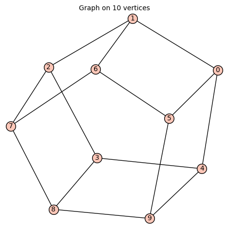

# 100 Problems for SageMath in Computational Mathematics

written by Heesung Shin, Inha University

## Sage 00

SageMath에서 $\displaystyle \left( \frac{5}{3} + \frac{5}{4} \right) \times \frac{6}{25} $의 값을 계산하여라. 
Python에서의 결과와 어떻게 다른지 설명하여라.

## Sage 01

SageMath 에서 다음을 실행하여 결과를 확인하여라.

    a, b = 16, 6
    print(a+b, a-b, a*b, a/b, a//b, a%b, a**b, a^b)

Python 에서 다음을 실행하여 Sage에서의 결과와 차이를 설명하여라.

    %%python3
    a, b = 16, 6
    print(a+b, a-b, a*b, a/b, a//b, a%b, a**b, a^b)

## Sage 02

$\sqrt{3}$과 $3^{\frac{1}{2}}$를 계산하여라.

## Sage 03

$\displaystyle \sin\left(\frac{\pi}{4}\right)$을 계산하여라.

## Sage 04

다음의 결과를 설명하여라.

    [1, 4, 2, 5..20, 2, 1, 2..10]

## Sage 05

다음을 실행한 후 range(a,b), srange(a,b), [a..b] 의 차이를 설명하여라.

    n = int(10)
    L = [n/k for k in range(1, n)]
    M = [n/k for k in srange(1, n)]
    N = [n/k for k in [1..n]]
    L, M, N

## Sage 06

다음 결과를 예측하여라.

    var('x')
    f = x^2 + 2*x + 1
    g = (x+1)^2
    bool(f == g)

## Sage 07

다음과 같은 코드가 실행되었을 때, $f\left(1,\sqrt{2}\right)$의 값을 구하는 코드를 만들어라.

    x, y = var('x, y')
    f(x,y)= (x+y)^2
    p = [x==1, y==sqrt{2}]

## Sage 08

$2x^3 - 20 x^2 + 62 x - 60 = 0$ 의 모든 해의 합과 곱을 계산하여라.

## Sage 09

함수 $f(x) = x^3 + 3 x^2 + 2 x + 1$ 의 극점을 모두 구하여라.

## Sage 10

`oct(100)`, `100.oct()`, `100.digits(8)`의 차이를 확인하여라.

## Sage 11

복소수 $a = 2 + i$에 대하여 $a^2$의 값을 구한 후, $a$의 실수부와 허수부를 각각 구하여라.

## Sage 12

이차방정식 $ax^2 + bx + c = 0$의 해를 구하여라.

## Sage 13

행렬 $A = \begin{pmatrix} -2 & 1 \\ 3 & 4 \end{pmatrix}$를 정의하고 $A$의 역행렬 $A^{-1}$을 구하여라.

## Sage 14

정적분 $\displaystyle \int_0^1 \sqrt{x}\sqrt{x+1} \ dx$을 구하여라.

## Sage 15

다음 극한 값을 계산하여라.
$$\lim_{x\to 2-} \frac{x^2 - 4}{\left|x-2\right|}$$

## Sage 16

다음을 실행하여 $f(x)$의 그래프를 보고, 함수 $f(x)$의 의미를 설명하여라.

    f = piecewise( [ [(0,1),-3], [[1,2],-1], [(2,3),1], [[3,4],3] ], var=x )
    p = f.plot(0, 4, figsize=[4,2])
    show(p)

## Sage 17

다음 함수를 정의하고, $f(0)$, $f(1)$, $f(-1)$의 값을 구하여라.
$$f(x) = \begin{cases} x^2y  & 0<x<2 \\ -xy^2 - 1, & -2 \le x \le 0 \end{cases}$$

## Sage 18

함수 $f(x)=\begin{cases}x, &0\leq x < 1\\ 2-x, &1\leq x<3\\ x-4, &3\leq x \leq 4\end{cases}$를 정의하고 $f(x)$의 그래프를 그려라.

## Sage 19

함수 $f(x) = \begin{cases} x^2 \sin\left(\frac{1}{x}\right), & x\neq 0\\ 0, &x=0 \end{cases}$의 그래프와 
도함수 $f'(x)$의 그래프를 그린 후에, 도함수 $f'(x)$의 불연속점을 찾아라.

## Sage 20

지수상수 e를 소수점 아래 100자리까지 표시하여라.

## Sage 21

50 이하의 소수를 출력하여라.

## Sage 22

$2755321$를 소인수분해 하여라.

## Sage 23

$50$ 이하의 자연수를 모두 $2$진수로 바꾸어 출력하여라.

## Sage 24

1과 20 사이에 있는 모든 소수(Prime number)의 곱은 9699690 이고, 이 수의 각 자리의 합은 48 이다. 1과 100 사이에 있는 모든 소수의 곱의 각 자리의 합을 구하여라.

## Sage 25

급수 $1^1+2^2+3^3+\cdots+10^{10}=10405071317$이고, 이 급수의 각 자리의 합은 $29$이다.
$100$보다 작은 모든 자연수 $n$에 대해, 급수 $1^1+2^2+3^3+\cdots+n^{n}$의 각 자리의 합을 모두 출력하여라.

## Sage 26

숫자 $n!!=n \times (n-2) \times (n-4) \times \cdots$이다.
예를 들어 숫자 $10!!= 10\times 8 \times 6 \times 4 \times 2 = 3840$이고, 
이 수의 각 자리의 합은 $15$이다.
$200$보다 작은 모든 양의 정수 $n$에 대해, 
숫자 $n!!$의 각 자리의 합을 리스트로 표현하고,
이 리스트의 곱을 구하여라.

## Sage 27

$60$의 약수 중 소수는 $2$, $3$, $5$가 있으므로, $60$의 약수 중 소수의 개수는 $3$이다.
$2$보다 크고 $200$보다 작은 모든 양의 정수 $n$에 대해, 
$n$의 약수 중 소수의 개수를 리스트로 표현하고,
이 리스트의 합을 구하여라.

## Sage 28

어떤 자연수의 제곱의 형태로 표시되는 것을 제곱수라 하고, 2 이상의 어떠한 제곱수도 약수로 가지지 않는 자연수를 **제곱수가 없는 수(Square-free number)** 라 부른다.
예를 들어, 20보다 작은 제곱수가 없는 수는 다음과 같이 된다.
$$1, 2, 3, 5, 6, 7, 10, 11, 13, 14, 15, 17, 19$$
제곱수가 없는 수를 작은 것 부터 나열했을 때, 1000번째 수를 구하여라.

## Sage 29

**과잉수**는 자연수 중에서 자기 자신을 제외한 양의 약수를 모두 더했을 때 원래의 수보다 더 커지는 수이다. 예를 들어 20의 약수 중 20을 제외한 것을 모두 더하면 $1+2+4+5+10=22$이기 때문에 20은 과잉수이다. 따라서 50보다 작은 과잉수는 다음과 같이 된다.
$$12, 18, 20, 24, 30, 36, 40, 42, 48$$
과잉수를 작은 것 부터 크기 순으로 $100$개의 수를 모두 출력하여라.

## Sage 30

$a$와 $b$가 주어져 있을 때, $f(x)=\cos(ax)+\sin(bx)$을 정의하자. $f(1),f(2),…,f(100)$ 중에서 가장 큰 값을 돌려주는 함수 $findmax(a,b)$ 를 만들어라.

## Sage 31

다음 급수의 값을 구하여라.
$$\sum_{n=1}^{\infty} \frac{1}{n+2} \left(\frac{2}{3}\right)^{n+1}$$

## Sage 32

$\sin(x)=\cos(x)$의 해를 구하여라. 
(Hint. Solve 에서 to_poly_solve 옵션을 사용해보자.)

## Sage 33

방정식 $\pi \cos x = x$가 몇 개의 실근을 가지는 확인하기 위하여,
함수 $f(x) = \pi \cos x$와 $g(x) = x$의 그래프를 같이 그려라.

## Sage 34

함수 $f(x) = x^3 - x^2 - x + 1$의 그래프를 그리고, 극점을 모두 표시하여라.

## Sage 35

직선 $y=x-1$, $x=0$, $x=2$과 곡선 $y=5-x^2$으로 둘러쌓인 영역을 표시하고, 그 넓이를 구하여라.

## Sage 36

평면에서 $x=t^2+1$, $y=t^3+t$ ($-3\le t \le 3$)로 서술되는 점 $(x,y)$의 집합은 곡선이다.
이 곡선 위의 점 $(2,2)$에서 이 곡선에 접하는 직선의 방정식을 구하고,
이 곡선과 이 직선의 방정식의 그래프를 같이 그려라.

## Sage 37

평면에서 방정식 $\tan x + 3 \sec y = 3 \sqrt{3}$의 그래프는 곡선이다.
이 곡선 위의 점 $\displaystyle \left(\frac{\pi}{3}, \frac{\pi}{6} \right)$에서 이 곡선에 접하는 직선의 방정식을 구하고,
이 곡선과 이 직선의 방정식의 그래프를 같이 그려라.

## Sage 38

implicit_plot3d 명령을 이용하여 다음 식을 만족하는 Hyperboloid를 그리시오.

$$\frac{x^2}{4}+\frac{y^2}{4}-\frac{z^2}{16}=1$$

## Sage 39

parametric_plot3d 명령을 이용하여 다음 식을 만족하는 Hyperboloid를 그리시오.

$$\frac{x^2}{4}+\frac{y^2}{4}-\frac{z^2}{16}=1$$

## Sage 40

$200$보다 작은 모든 양의 정수 $n$에 대해, 
$n$의 약수의 합을 리스트로 구성하고,
이 리스트의 곱을 구하여라.

## Sage 41

$11$의 배수 중 십의 자리가 $4$인 $10000$ 이하의 자연수를 크기 순으로 리스트로 구성하고, 이 리스트의 합을 구하여라.

## Sage 42

3의 배수거나 5의 배수거나 7의 배수인 자연수를 작은 것 부터 크기 순으로 100개를 출력하여라.

## Sage 43

3, 5, 7을 제외한 어떤 소수로도 나누어지지 않는 자연수를 작은 것 부터 크기 순으로 100개를 출력하여라.

## Sage 44

함수 $f,g: [0, \pi] \to \mathbb{R}$가 각각 $f(x) = \sin(2x)$와 $g(x) = \cos(x)$로 정의되었다.
두 함수의 그래프로 둘러싸인 평면 영역을 표시하고, 이 영역의 넓이를 구하여라.

## Sage 45

$\displaystyle \int_0^{\frac{\pi}{12}}4\cos(4x) \ dx$ 을 계산하시오.

## Sage 46

$\displaystyle \int_{\sqrt{2}}^{2} x^3\sqrt{x^4-4} \ dx$ 을 계산하시오.

## Sage 47

$\displaystyle \int_1^2(3x^2+1)\sqrt{x^3+x-1} \ dx$ 을 계산하시오.

## Sage 48

평면에서 $x=\cos t + 1$, $y = \sin(2t)$ ($0\le t \le \pi$)로 서술되는 점 $(x,y)$의 집합은 곡선이다.
이 곡선 위의 점 $\displaystyle \left(\frac{3}{2}, \frac{\sqrt{3}}{2}\right)$에서 이 곡선에 접하는 직선의 방정식을 구하고,
이 곡선과 이 직선의 방정식의 그래프를 같이 그려라.

## Sage 49

다음 이중적분의 적분영역을 그래프로 표시하고, 적분값을 구하여라.
$$\int_0^9 \int_{\sqrt{y}}^3 \sin(\pi x^3)\ dx dy$$

## Sage 50

오일러 공식 $\displaystyle e^{ix} = \cos x + i\sin x$ 가 성립함을 보여라.

## Sage 51

약수 중에 소수가 $3$개 이상인 자연수를 작은 것 부터 크기 순으로 $100$개를 리스트로 구성하고, 이 리스트의 합을 구하여라.

## Sage 52

방정식 $x^{2/3} + y^{2/3} = 1$ ($-1\le x\le 1$)의 그래프를 `아스테로이드(asteroid)`라고 부른다.
아스테로이드의 그래프를 그리고, 아스테로이드 전체의 길이를 구하여라.

## Sage 53

다음 적분의 기하적인 의미를 가지는 영역을 그래프로 표시하고, 그 영역의 넓이를 구하여라.
$$\int_{1/2}^{\sqrt{3}/2} \frac{5}{1-x^2} \ dx$$

## Sage 54

함수 $f(x)=\ln(x^2+x+1)$의 $x=1$에서의 $10$차 테일러 다항식을 정의에 의해 구하여라.
$$f(x) \approx f(1) + \frac{f'(1)}{1!}(x-1) + \frac{f''(1)}{2!}(x-1)^2 + \cdots + \frac{f^{(10)}(1)}{10!}(x-1)^{10}$$

## Sage 55

함수 $f(x)=\ln(𝑥^2+𝑥+1)$의 $x=1$에서의 $10$차 테일러 다항식을 taylor 명령어를 이용하여 구하여라.

## Sage 56

함수 $f(x)=\ln(𝑥^2+3𝑥+3)$의 $x=0$에서의 $10$차 테일러 다항식을 series 명령어를 이용하여 구하여라.

## Sage 57

$u = \tan^{-1} \left( \frac{x^4+y^4}{x^2+y^2} \right)$ 일 때, 다음을 보여라. $$x \frac{\partial u}{\partial x} + y \frac{\partial u}{\partial y} = \sin 2u$$

## Sage 58

$u = \frac{x^4 + y^4}{x^2 y^2} + x^6 \tan^{-1} \left( \frac{x^2+y^2}{x^2 + 2xy} \right)$ 일 때, $x=1$, $y=1$ 에서의 다음 값을 구하여라. $$x^2 \frac{\partial^2 u}{\partial x^2} + 2xy\frac{\partial^2 u }{\partial x \partial y} + y^2 \frac{\partial^2 u}{\partial y^2} + x \frac{\partial u}{\partial x} + y \frac{\partial u}{\partial y}$$

## Sage 59

$u = \sin^{-1} \left( \frac{x^{1/4} + y^{1/4}}{x^{1/5} + y^{1/5}} \right)$ 일 때, 다음을 보여라. $$ x \frac{\partial u}{\partial x} + y \frac{\partial u}{\partial y} = \frac{1}{20} \tan u $$

## Sage 60

$x00, x01, ..., x99$ 까지 100개의 Sage 변수를 생성하여라.

## Sage 61

극방정식 $r=2\cos \theta + 2 \sin \theta$의 그래프는 곡선이다.
이 곡선의 그래프를 그리고, 이 곡선의 길이를 구하여라.

## Sage 62

리스트를 입력 받아서, 리스트의 원소의 평균에 가장 가까운 수부터 출력하는 함수 `meansort`를 만들어라.
평균과 거리가 같은 경우에는 입력순서대로 출력한다.

예를 들어, 다음과 같이 실행되어야 한다.

    >>> meansort(1,2,3,4,5,6,7,8,9,10,12)
    (6, 7, 5, 8, 4, 9, 3, 10, 2, 1, 12)
    >>> meansort(1,-1,-2,2,0)
    (0, 1, -1, -2, 2)

## Sage 63

다음을 계산하여라.
$$\displaystyle \int_{-a}^{a} \int_{\left| y \right|}^a (x+y)^2 \ dx \ dy$$

## Sage 64

다음을 계산하여라.
$$\displaystyle \int_{1}^{2} \int_{0}^{\ln x} (x-1)\sqrt{1+e^{2y}} \ dy \ dx$$

## Sage 65

$C$ 는 $x^2+y^2 = 1$, $z=y+1$ 를 만족하는 타원이다. $C$를 그려라

## Sage 66

다음을 직접 계산하여라.
$$\int_C (4z\ dx - 3x \ dy +2x \ dz )$$
여기서 $C$ 는 $x^2+y^2 = 1$, $z=y+1$ 를 만족하는 타원이다. 

## Sage 67

Stokes' Theorem을 이용하여 다음 식을 계산하여라.
$$\int_C (4z\ dx - 3x \ dy +2x \ dz )$$
여기서 $C$ 는 $x^2+y^2 = 1$, $z=y+1$ 를 만족하는 타원이다.

## Sage 68

Green 정리를 이용하여 다음을 계산하여라.
$$\int_C (\cos x \sin y - xy) \ dx + (\sin x \cos y) \ dy$$
여기서 $C$는 $x^2+y^2=1$을 만족하는 원이다.

## Sage 69

Green 정리를 이용하여 다음을 계산하여라.
$$\int_C (x^2-\cosh y) \ dx + (y+\sin x) \ dy$$
여기서 $C$는 $0\le x \le \pi$, $0 \le y \le 1$인 사각형의 테두리이다. (반시계 방향) 

## Sage 70

다음 연분수의 분자와 분모를 구하여라.
$$1+\frac{1}{1+\frac{1}{1+\frac{1}{1+\frac{1}{1+\frac{1}{1}}}}}$$

## Sage 71

다음 식을 분모가 1차식인 두 분수의 합으로 표현하여라.
$$\frac{2}{x^2-1}$$

## Sage 72

다음 연립방정식을 풀어라
$$\left\{ \begin{align*} x+y+z &= 0 \\ y+z &= 0 \end{align*} \right.$$

## Sage 73

다음 연립방정식을 풀어라
$$\left\{ \begin{align*} x+y+z -w &= 0 \\ x-y+2z + w &= 0 \\ x-z-5w &= 0\end{align*} \right.$$

## Sage 74

행렬 $A =  \left(\begin{array}{rrrr} 4 & 6 & -3 & 7 \\ 90 & -76 & 3 & 5 \\ 24 & 5 & 6 & 3 \\ -6 & 3 & 14 & 23 \end{array}\right)$, $B= \left(\begin{array}{rrrr}  122 & 5 & -54 & 34 \\ 7 & 63 & -6 & 26 \\ 23 & 6 & 735 & -42 \\ 56 & 4 & 5 & 9 \end{array}\right)$ 에 대해서, $(AB)^{-1} = B^{-1} A^{-1}$ 이 성립함을 보여라.

## Sage 75

다음 행렬을 만들어 보자.
$$\left(\begin{array}{rrrrrrrrr}
1 & \frac{1}{2} & \frac{1}{3} & \frac{1}{4} & \frac{1}{5} & \frac{1}{6}
& \frac{1}{7} & \frac{1}{8} & \frac{1}{9} \\
\frac{1}{2} & \frac{1}{3} & \frac{1}{4} & \frac{1}{5} & \frac{1}{6} &
\frac{1}{7} & \frac{1}{8} & \frac{1}{9} & \frac{1}{10} \\
\frac{1}{3} & \frac{1}{4} & \frac{1}{5} & \frac{1}{6} & \frac{1}{7} &
\frac{1}{8} & \frac{1}{9} & \frac{1}{10} & \frac{1}{11} \\
\frac{1}{4} & \frac{1}{5} & \frac{1}{6} & \frac{1}{7} & \frac{1}{8} &
\frac{1}{9} & \frac{1}{10} & \frac{1}{11} & \frac{1}{12} \\
\frac{1}{5} & \frac{1}{6} & \frac{1}{7} & \frac{1}{8} & \frac{1}{9} &
\frac{1}{10} & \frac{1}{11} & \frac{1}{12} & \frac{1}{13} \\
\frac{1}{6} & \frac{1}{7} & \frac{1}{8} & \frac{1}{9} & \frac{1}{10} &
\frac{1}{11} & \frac{1}{12} & \frac{1}{13} & \frac{1}{14} \\
\frac{1}{7} & \frac{1}{8} & \frac{1}{9} & \frac{1}{10} & \frac{1}{11} &
\frac{1}{12} & \frac{1}{13} & \frac{1}{14} & \frac{1}{15} \\
\frac{1}{8} & \frac{1}{9} & \frac{1}{10} & \frac{1}{11} & \frac{1}{12} &
\frac{1}{13} & \frac{1}{14} & \frac{1}{15} & \frac{1}{16} \\
\frac{1}{9} & \frac{1}{10} & \frac{1}{11} & \frac{1}{12} & \frac{1}{13} &
\frac{1}{14} & \frac{1}{15} & \frac{1}{16} & \frac{1}{17}
\end{array}\right)$$

## Sage 76

다음 행렬식에 대해 간단한 공식을 찾아라.
$$A = \left(\begin{array}{rrr} {\left(a + b\right)}^{2} & c^{2} & c^{2} \\ a^{2} & {\left(b + c\right)}^{2} & a^{2} \\ b^{2} & b^{2} & {\left(a + c\right)}^{2} \end{array}\right)$$

## Sage 77

다음 행렬식을 구하여라.
$$B =  \left(\begin{array}{ccccc} 1 & 1 & 1 & \dots & 1 \\ x_1 & x_2 & x_3 &\dots &x_n\\  {x_1}^{2} & {x_2}^{2} & {x_3}^{2} & \dots & {x_n}^{2}\\ \vdots & \vdots &\vdots &\ddots & \vdots \\ {x_1}^{n-1} & {x_2}^{n-1} &{x_3}^{n-1} &\dots & {x_n}^{n-1} \end{array}\right)$$

## Sage 78

다음 연립방정식을 크래머 법칙을 이용하여 그 해를 구하여라.
$$\left\{ \begin{align*} x+y&=4 \\ y+z-2w &=1\\ x+2z+w &=0 \\ x+y+w &=0 \end{align*} \right.$$

## Sage 79

아래 행렬의 특성방정식을 구하여라. 그리고 그 방정식의 근을 공학적 도구로 이용하여 고유값과 고유벡터를 구하여라.

$$\left(\begin{array}{rrrrr}1 & 1 & 2 & 1 & 1 \\1 & 2 & 3 & 2 & 1 \\2 & 3 & 1 & 2 & 1 \\1 & 2 & 2 & 3 & 1 \\1 & 1 & 1 & 1 & 7\end{array}\right)$$

## Sage 80

`n = 74516`을 이용하여 `[7,4,5,1,6]`을 만들고, `L = [3,7,6,2,5]`을 이용하여 `37625`을 만들어라.

## Sage 81

`n = 323431`의 각 자리에 사용된 숫자와 그 개수가 같은 5자리 정수를 작은 것 부터 큰 순으로 모두 출력하고, 그 개수를 구하여라.

## Sage 82

다음과 같이 파스칼 삼각형의 처음 11줄을 출력하여라.

       1 
       1    1 
       1    2    1 
       1    3    3    1 
       1    4    6    4    1 
       1    5   10   10    5    1 
       1    6   15   20   15    6    1 
       1    7   21   35   35   21    7    1 
       1    8   28   56   70   56   28    8    1 
       1    9   36   84  126  126   84   36    9    1 
       1   10   45  120  210  252  210  120   45   10    1 

## Sage 83

다음과 같이 `Suits`, `Values`, `Cards`, `Hands`, `Flushes`를 정의하자.

    Suits = Set(["Hearts", "Diamonds", "Spades", "Clubs"])
    Values = Set([2, 3, 4, 5, 6, 7, 8, 9, 10, "Jack", "Queen", "King", "Ace"])
    Cards = cartesian_product([Values, Suits])
    Hands = Subsets(Cards, 5)
    Flushes = cartesian_product([Subsets(Values, 5), Suits])
    
Flush가 나올 확률을 계산하여라.

## Sage 84

위의 문제에서 정의된 변수를 그대로 사용하자. Hands의 원소를 임의로 10000번 선택하였을 때 Flush가 나오는 경우를 모두 출력하고 그 개수를 세어라.

## Sage 85

길이가 유한한 수열 $a_1, a_2, \dots, a_\ell$이 다음 두 조건을 모두 만족할 때, 이를 정수 $n$의 `composition`이라고 한다.
* 모든 $1\leq k \leq \ell$에 대하여 $a_k \geq 1$
* $n = a_1 + a_2 + \dots + a_\ell$

$15$의 composition 중 $a_i$가 전부 3보다 작거나 같은 것을 나열하고, 그 개수를 구하여라.

## Sage 86

길이가 유한한 수열 $a_1, a_2, \dots, a_\ell$이 다음 두 조건을 모두 만족할 때, 이를 정수 $n$의 `정수분할`이라고 한다.
* $a_1 \geq a_2 \geq \dots \geq a_\ell \geq 1$
* $n = a_1 + a_2 + \dots + a_\ell$

(1) $15$의 정수분할 중 $a_i$가 모두 홀수인 것을 나열하고, 그 개수를 구하여라.

(2) $15$의 정수분할 중 $a_i$가 모두 다른 것을 나열하고, 그 개수를 구하여라.

## Sage 87

다음 코드를 실행한 결과를 확인한 후, 결과가 의미하는 가설을 세우고 이를 증명하여라.

    var('x')
    for n in range(10):
        sum( x^len(c) for c in Compositions(n) ).factor().show()

## Sage 88

자연수 $n$과 $k$에 대해서, 제2종 스털링 수 $S(n,k)$는 크기가 $n$인 집합의 원소를 $k$개의 그룹으로 나누는 방법의 개수로 정의한다. 예를 들어, 크기가 4인 집합 $\left\{a,b,c,d\right\}$의 원소를 3개의 그룹으로 분할하는 방법은
$$ ab-c-d,~ ac-b-d,~ ad-b-c,~ a-bc-d,~ a-bd-c,~ a-b-cd$$
이고, $S(4,3)=6$ 이다. $S(100,10)$의 마지막 20자리수를 구하여라

## Sage 89

0 부터 9까지 10개의 숫자를 모두 사용해 규칙에 맞는 수를 만들어라.

- 첫 번째 숫자까지 1로 나누어진다.
- 두 번째 숫자까지 2로 나누어진다.
- 세 번째 숫자까지 3로 나누어진다.
- 네 번째 숫자까지 4로 나누어진다.
- 다섯 번째 숫자까지 5로 나누어진다.
- 여섯 번째 숫자까지 6로 나누어진다.
- 일곱 번째 숫자까지 7로 나누어진다.
- 여덟 번째 숫자까지 8로 나누어진다.
- 아홉 번째 숫자까지 9로 나누어진다.
- 열 번째 숫자까지 10로 나누어진다.

## Sage 90

다음 코드의 결과를 확인하고, all과 any의 용법을 설명하여라.

    a = all([True, True, True, True])
    b = all([True, False, True, True])
    c = any([False, False, False, False])
    d = any([False, False, True, False])
    print(a,b,c,d)

## Sage 91

$2^n-1$이 소수가 되게 하는 $100$이하의 모든 자연수를 구하여라.

## Sage 92

$p<1000$일 때, $2^p - 1$이 소수이면 $p$가 소수임을 보여라.

## Sage 93

$p<1000$일 때, $p$가 소수이면 $2^p - 1$이 소수임을 보이거나 반례(counter-example)를 구하여라.

## Sage 94

$x^3 + y^3 = 218$ 을 만족하는 두 정수 $x$, $y$를 구하여라.

## Sage 95

다음 코드를 실행하고 그 의미를 확인하여라.

    up_to_four_edges = list(graphs(5, lambda G: G.size() <= 4))
    pretty_print(*up_to_four_edges)

## Sage 96

다음 코드를 실행하고 그 의미를 확인하여라.
    
    G0 = Graph({0: [1, 2, 3, 4, 5, 6, 7]} )
    G0.plot().show()

    G1 = G0.to_directed()
    G1.plot().show()

    G2 = DiGraph({0: [1, 2, 3, 4, 5, 6, 7], 1: [0], 2: [0], 3: [0], 4: [0], 5: [0], 6: [0], 7: [0]} )
    G2.plot().show()
    G1 == G2

## Sage 97

다음과 위상동형인 그래프 G를 만들고, G의 인접행렬을 구하여라.

## Sage 98

`stl_ascii_string()`을 사용하여 3차원으로 그려진 객체를 입력받아 STL 파일로 저장하는 함수를 만들어라.

## Sage 99

다음 식을 만족하는 대수 곡면을 Dullo라 한다. 이 3차원 물체를 그리고 STL 파일로 저장하여라.
$${\left(x^{2} + y^{2} + z^{2}\right)}^{2} = x^{2} + y^{2}$$

## Sage 100

다음 식을 만족하는 대수 곡면을 Citric 라 한다. 이 3차원 물체를 그리고 STL 파일로 저장하여라.
$$x^{2} + z^{2} = -{\left(y - 1\right)}^{3} y^{3}$$

## Sage 101

다음 식을 만족하는 대수 곡면을 Kreisel 라 한다. 이 3차원 물체를 그리고 STL 파일로 저장하여라.
$$60 \, {\left(x^{2} + y^{2}\right)} z^{4} = -{\left(x^{2} + y^{2} + z^{2} - 60\right)}^{3}$$

## Sage 102

다음 식을 만족하는 대수 곡면을 Zeck 라 한다. 이 3차원 물체를 그리고 STL 파일로 저장하여라.
$${\left(z - 1\right)} z^{3} + x^{2} + y^{2} = 0$$

## Sage 103

다음 식을 만족하는 대수 곡면을 Croissant 라 한다. 이 3차원 물체를 그리고 STL 파일로 저장하여라.
$$-y^{2} {\left(\sqrt{5} + 1\right)}^{2} + \frac{1}{4} \, {\left(2 \, x^{2} + 2 \, y^{2} + 2 \, z^{2} + 7 \, \sqrt{5} - 11\right)}^{2} - {\left(x {\left(\sqrt{5} + 1\right)} + 3 \, \sqrt{5} - 7\right)}^{2} = 0$$

## Sage 104

다음 식을 만족하는 대수 곡면을 3-torus 라 한다. 이 3차원 물체를 그리고 STL 파일로 저장하여라.
$${\left({\left({\left(x + 4\right)}^{2} + y^{2} + z^{2} + 8\right)}^{2} - 36 \, {\left(x + 4\right)}^{2} - 36 \, y^{2}\right)}\\ \times {\left({\left({\left(x - 4\right)}^{2} + y^{2} + z^{2} + 8\right)}^{2} - 36 \, {\left(x - 4\right)}^{2} - 36 \, y^{2}\right)}\\ \times {\left({\left(x^{2} + {\left(y + 6\right)}^{2} + z^{2} + 8\right)}^{2} - 36 \, x^{2} - 36 \, {\left(y + 6\right)}^{2}\right)} = 5000000$$
